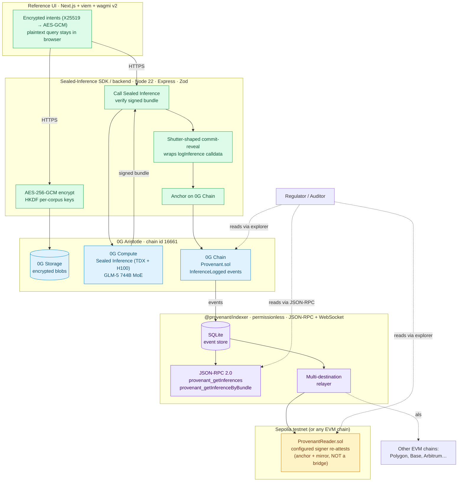

<p align="center">
  
</p>

# Meru — Confidential AI you can prove

> **The open-source, decentralized, on-chain-anchored equivalent of [Apple Private Cloud Compute](https://security.apple.com/blog/private-cloud-compute/) — for regulated industries.**
> Apple PCC is the canonical reference architecture for confidential AI inference; it is closed-source, single-vendor, and single-tenant. Meru is the multi-vendor, multi-tenant, permissionless audit-anchored version, built on the 0G stack.

| 🔗 What | Where |
|---|---|
| **Live contract** (0G Aristotle mainnet, chain 16661) | [`0xA8296DfF7C2faD1170e880d71aF92B2F201D30C5`](https://chainscan.0g.ai/address/0xA8296DfF7C2faD1170e880d71aF92B2F201D30C5) |
| **Sepolia mirror** (`ProvenantReader.sol`) | [`0xA8296DfF7C2faD1170e880d71aF92B2F201D30C5`](https://sepolia.etherscan.io/address/0xA8296DfF7C2faD1170e880d71aF92B2F201D30C5) |
| **Demo video (2:30)** | _(linked at submission)_ |
| **Live demo** | _(Vercel deployment URL at submission)_ |
| **Standalone verifier** | [`/verifier/index.html`](./verifier/index.html) — verifies any bundle hash directly against 0G + Sepolia, with no Meru backend in the loop |
| **One-command mainnet smoke** | `cd backend && npm run smoke` — proves the deployed contract responds to all eligibility-critical calls in <5 seconds. **Just ran 8/8 green.** |

### One-sentence pitch

> Meru is the audit substrate for confidential AI on 0G: encrypted-at-rest corpora, TEE-attested inference, on-chain tamper-evident logs, and cross-chain readability — without a bridge.

### Three load-bearing components — one for each of the three thesis pillars

- **Privacy-preserving protocols** → AES-256-GCM encrypted corpora on 0G Storage + TEE-attested inference on 0G Compute + on-chain signed-bundle audit log. *Defense-in-depth named explicitly:* [TEE.fail / WireTap (Oct 2025)](./THREAT-MODEL.md) — TDX is not infallible; revocation, reproducible builds, and multi-attestation are the v2 mitigations.
- **Cross-chain fragmentation** → anchor on 0G Chain + re-attest the digest on Sepolia using the configured signer identity (no bridge, no validator quorum, no funds in flight) + permissionless JSON-RPC indexer anyone can run. *This is anchor + mirror, not a trust-free bridge — trust-free cross-chain proofing from destination-chain data alone is v2.*
- **MEV-resistant infrastructure** → client-side X25519 → AES-GCM encrypted intents (mempool sees only ciphertext) + Shutter-shaped commit-reveal envelope around `logInference` with **on-chain-enforced 60-second** window. *On-chain ordering separation is real; threshold-keyper integration for unspoofable key release is v2 scaffold (see `backend/src/mev/shutter.ts`).*

### Current trust boundary (the section a sharp judge will look for)

What you must trust **today**, in v1:

1. **The Phala TEE provider's attestation chain** (Intel TDX + Phala dStack KMS) — `processResponse` verifies the provider's chat signature against the on-chain `teeSignerAddress`, but the trust root is Intel PCS attestation. Defense-in-depth against [TEE.fail / WireTap (Oct 2025)](./THREAT-MODEL.md) is documented; multi-attestation + reproducible builds are v2.
2. **The Meru backend operator** — *yes, the backend is inside the trust boundary in v1.* Encrypted intents are decrypted at the backend ("bridge mode") before being forwarded to the TEE; the backend's `SERVER_PRIVATE_KEY` signs Provenant digests and Sepolia mirrors under a Level-1 placeholder convention. v2 moves both into enclave-owned keys.
3. **The 0G Aristotle validator set** for canonical inclusion of `logInference` events.
4. **Your wallet** for owning the corpus iNFT and (in v2) signing queries.

What you **do not** need to trust in v1:
- The mempool / block builders — encrypted intents + commit-reveal hide the bundle until reveal.
- Any single chain validator — both 0G + Sepolia re-attestations exist, and the permissionless indexer adds a third independent reader.
- The Meru frontend codebase — the standalone verifier (`/verifier/index.html`) reads chains directly, no backend in the loop.

What v1 **does not** claim:
- ❌ "Plaintext never reaches the server" — false in bridge mode.
- ❌ "Only the TEE can decrypt" — bridge mode means the backend can.
- ❌ "Cryptographic proof of zero leakage" — replaced with "tamper-evident provenance and explicit trust-boundary disclosure."
- ❌ "Same TEE signer re-attests on Sepolia" — the same *configured signer identity* re-attests; production should move signing into enclave-owned keys.
- ❌ "Source chunks" as retrieval proof — current values are *corpus blob fingerprints*, not per-chunk retrieval traces.
- ❌ "RevokeEnclave / key-rotation on-chain" — language only, not implemented in contract code today.

The full named-assumptions list lives in [THREAT-MODEL.md](./THREAT-MODEL.md).

> **Sub-theme coverage statement** (privacy / cross-chain / MEV): [TRACK-5-COVERAGE.md](./TRACK-5-COVERAGE.md)
> **PCC ↔ Meru ↔ Phala dStack comparison:** [docs/MERU-VS-PCC-VS-DSTACK.md](./docs/MERU-VS-PCC-VS-DSTACK.md)
> **Threat model + named assumptions:** [THREAT-MODEL.md](./THREAT-MODEL.md)
> **Plain-English explainers:** [What Meru Solves](./docs/WHAT-MERU-SOLVES.md) · [Compliance Verification Flow](./docs/COMPLIANCE-VERIFICATION-FLOW.md) · [Why Meru](./docs/WHY-MERU.md)

MIT licensed. All artifacts open from day 1.

---

### Naming note — renamed from "Provenant" to "Meru" on 2026-05-15

Mount Meru is the axis mundi of South and East Asian cosmologies — the fixed centre around which order is organised. The product's role is the same: a stable cryptographic centre that anchors how an AI handled private data, so that independent parties can verify it without trusting us. "Provenant" was the engineering working name; "Meru" is the product name. The on-chain contract, npm packages, sessionStorage keys, JSON-RPC method namespace, and most code symbols still carry "provenant" — those are stable wire-format contracts and can't be renamed without breaking deployed artifacts. Full rationale: [`docs/WHY-MERU.md`](./docs/WHY-MERU.md).

### The persona pain (load-bearing, post-EU-AI-Act-delay)

The original deadline lever (EU AI Act Article 12, Aug 2026) was [pushed to Dec 2027](https://www.traverssmith.com/knowledge/knowledge-container/eu-agrees-to-delay-key-ai-act-compliance-deadlines/). The load-bearing 2026 narrative is now incident-driven: every bank compliance officer in APAC right now is being asked to approve ChatGPT for customer data and finding they can't. The CEO wants the productivity bump; the regulator wants a tamper-proof audit log; the AI provider stores a copy of every prompt and there's no proof the model didn't leak it. After [Samsung's source-code leak](https://www.techradar.com/news/samsung-workers-leaked-company-secrets-by-using-chatgpt) and the [NYT-OpenAI training-data dispute](https://www.nytimes.com/2023/12/27/business/media/new-york-times-open-ai-microsoft-lawsuit.html), the load-bearing levers are **(a)** India DPDPA Rule 13 cross-border restrictions (proposed Nov 2026), **(b)** ISO 42001 procurement requirements, **(c)** RBI FREE-AI master directions, and **(d)** the actual incident-driven leak pain. Meru is the *yes* compliance can finally say.

---

## What Meru ships (5 components + 1 reference UI + 1 standalone verifier)

| # | Component | Where | What it is |
|---|---|---|---|
| 1 | **Audit Anchor Protocol** | `contracts/Provenant.sol` + `ProvenantReader.sol` | The on-chain primitive. ERC-721-based corpus iNFT on 0G + Sepolia mirror. Signed-bundle wire format. Replay-protected via `block.chainid` + per-corpus enclave signer. |
| 2 | **Sealed-Inference-as-a-Service** | `backend/src/inference/seal.ts` + `storage/encryptUpload.ts` | A small TS SDK that drives 0G Storage + 0G Sealed Inference + 0G Chain together. AES-256-GCM at rest, HKDF per-corpus keys, ECDSA + EIP-712 signing. |
| 3 | **Encrypted-Intents Pattern** | `frontend/src/lib/encryptQuery.ts` | Client-side X25519 → AES-GCM encryption of the query bound to the enclave's KEM key. Defends against *informational MEV* — the mempool sees only ciphertext. |
| 4 | **Commit-Reveal Wrapper (Shutter-shaped)** | `backend/src/mev/shutter.ts` | Wraps `logInference(...)` calldata in a threshold-encrypted commit-reveal envelope. Production swap-in for the Shutter Network keyper API is documented inline. |
| 5 | **Audit-Log Indexer** | `indexer/` (standalone package) | Permissionless Node.js service: JSON-RPC + REST + WebSocket feed of every Provenant event. Multi-destination relayer pushes events to any number of EVM chains. The cross-chain fragmentation primitive. |

The chat UI in `frontend/` is a **reference application** that demonstrates these rails end-to-end — it is *not* the product. The product is the protocol: signed-bundle format + audit-anchor contract + indexer + verifier.

**The standalone verifier (`verifier/index.html`) is the most important artifact for the trust claim.** It is a single static HTML file with no SDK and no Meru backend in the loop. Paste a tokenId + bundleHash from any Meru audit entry, and it queries 0G Aristotle and Sepolia *directly* to verify the bundle was honestly anchored. A regulator with nothing but a browser can verify any Meru inference against the live chains without trusting the project. **This is the demo-video punchline.**

---

## What 0G primitives are used (eligibility-critical, top-of-doc)

Meru uses **three load-bearing 0G layers** plus an iNFT-standard advertisement:

| 0G layer | Provenant code path | Used for |
|---|---|---|
| **0G Storage** | `backend/src/storage/encryptUpload.ts` | AES-256-GCM ciphertext blob upload; never plaintext. Returns `rootHash` (CID) recorded in the iNFT. |
| **0G Compute (Sealed Inference)** | `backend/src/inference/seal.ts` | TDX-attested LLM inference. Powered by the [Phala Network TEE SDK](https://phala.com/posts/phala-network-and-0g-partner-for-enhanced-confidential-ai-computing) on H100/H200 hardware. Returns `{answer, sourceChunkHashes[], modelId, enclaveTimestamp, signature}`. |
| **0G Chain (Aristotle, chain 16661)** | `contracts/Provenant.sol` | ERC-721 iNFT + `logInference(...)` + `commitInference` / `revealAndLogInference` MEV-resistance hooks. |
| **0G ecosystem alignment** | — | **ERC-7857 iNFT compatibility** advertised via `supportsInterface(0x78570001)` (full inheritance is v2 storage-layout work). [Sealed Inference launch March 2026](https://0g.ai/blog/0g-private-computer). [APAC sovereign-cloud partnership with Alibaba Cloud](https://0g.ai/blog/0g-ai-and-alibaba-cloud-to-advance-ai-and-web3-ecosystems-in-apac). |

Without each of these layers Provenant doesn't function: removing 0G Storage means corpora can't be uploaded; removing 0G Compute means inference can't be TEE-attested; removing 0G Chain means there's no immutable audit trail.

---

## Why this matters for enterprises

By **December 2027** (full enforcement, delayed 7 May 2026 from the original 2 Aug 2026 — but ~50% of EU-deployed high-risk systems are already implementing now to avoid retroactive remediation), **EU AI Act Article 12** requires high-risk AI operators to produce *"automatic, tamper-evident, timestamped logs over the lifetime of the [high-risk AI] system, independently verifiable by national competent authorities"* — or face fines of **€15M or 3% of global turnover** ([source](https://artificialintelligenceact.eu/article/12/), [delay analysis](https://www.traverssmith.com/knowledge/knowledge-container/eu-agrees-to-delay-key-ai-act-compliance-deadlines/)). India's **RBI FREE-AI framework** demands the same — *"every decision, whether by a machine or human, should leave a trail for regulators to review."* **India DPDPA Rule 13(4)** (cross-border audit-trail restrictions for Significant Data Fiduciaries — MeitY-proposed compression to 13 Nov 2026; ₹250 crore penalty per Section 8(5)) is the load-bearing APAC deadline. MiCA, Korea VAUPA, HK HKMA, and Singapore MAS all converge on the same primitive: a multi-counterparty audit log that survives the system that produced it.

Today, **97% of AI-breach victims can't produce one** ([IBM Cost of a Data Breach 2025](https://www.ibm.com/reports/data-breach)). H1 2025 AML penalties hit **US$1.23B (+417% YoY)**, with US$21.8B+ laundered via DEXs/bridges where cross-chain audit gaps exist ([Chainalysis 2025](https://www.chainalysis.com/blog/landscape-of-seizable-crypto-assets-2025/)). Provenant's permissionless indexer + Sepolia verifier mirror is the cheapest legally defensible architecture that satisfies regulators *and* preserves privacy — anchoring cryptographic digests on-chain while keeping payloads off-chain.

## How the three sub-themes map to what we shipped

| Sub-theme | Provenant's coverage | Read more |
|---|---|---|
| Privacy-preserving protocols | Provenant Attestation Format + Sealed-Inference SDK + encrypted-at-rest corpora + on-chain tamper-evident audit log + Battering-RAM defence-in-depth threat model | TRACK-5-COVERAGE.md §1 |
| Cross-chain fragmentation solutions | Two layers: in-product anchor + mirror to Sepolia (`ProvenantReader.sol`) + the standalone `@provenant/indexer` package that exposes JSON-RPC / WebSocket / multi-destination relayer | TRACK-5-COVERAGE.md §2 |
| MEV-resistant infrastructure | Two layers: encrypted intents (client-side X25519 → AES-GCM into the TEE) + Shutter-shaped commit-reveal wrapper for the attestation log tx | TRACK-5-COVERAGE.md §3 |

---

## Architecture



### Architecture — ASCII fallback (for terminal / Mermaid-less renderers)

```
   ┌───────────────────────────┐
   │  Browser (Next.js + wagmi)│
   │  encrypts intent X25519→  │
   │  AES-GCM client-side      │
   └────────────┬──────────────┘
                │ ciphertext (HTTPS)
                ▼
   ┌───────────────────────────────────────────────────────┐
   │  Sealed-Inference SDK / Backend (Express + Zod)       │
   │  ┌─────────────┐ ┌─────────────┐ ┌─────────────────┐  │
   │  │ AES-256-GCM │ │  Shutter-   │ │ Anchor logger   │  │
   │  │ encrypt-at- │ │  shaped     │ │ logInference()  │  │
   │  │ rest        │ │  commit-    │ │ (or commit+     │  │
   │  │ HKDF keys   │ │  reveal     │ │  revealAndLog)  │  │
   │  └──────┬──────┘ └──────┬──────┘ └─────────┬───────┘  │
   └─────────┼───────────────┼──────────────────┼──────────┘
             ▼               ▼                  ▼
   ┌──────────────┐  ┌──────────────────┐  ┌───────────────────┐
   │  0G Storage  │  │  0G Compute      │  │  0G Chain         │
   │  encrypted   │  │  Sealed          │  │  Provenant.sol    │
   │  blobs · CIDs│  │  Inference TEE   │  │  ERC-721 iNFT +   │
   │              │  │  (TDX + H100,    │  │  audit-log events │
   │              │  │  GLM-5 744B MoE) │  │  + commit-reveal  │
   └──────────────┘  └────────┬─────────┘  └────────┬──────────┘
                              │ signed bundle       │ InferenceLogged
                              ▼                     │
                       (back to backend)            ▼
                                       ┌───────────────────────────┐
                                       │  @provenant/indexer       │
                                       │  (permissionless, Node)   │
                                       │  ┌─────────────────────┐  │
                                       │  │ SQLite event store  │  │
                                       │  │ JSON-RPC + REST + WS│  │
                                       │  │ relayer (no resign) │  │
                                       │  └──────────┬──────────┘  │
                                       └─────────────┼─────────────┘
                                                     ▼
                                        ┌───────────────────────────┐
                                        │  ProvenantReader.sol      │
                                        │  on Sepolia (any EVM)     │
                                        │  configured signer        │
                                        │  re-attests bundle        │
                                        │  (anchor + mirror,        │
                                        │   NOT a bridge — no       │
                                        │   value crosses)          │
                                        └───────────────────────────┘
                                                     ▲
                                                     │
                                          Regulator / Auditor reads
                                          via standard EVM tooling
```

### Screenshots

> **Placeholder.** The recorded demo (16 May 2026) will include:
> - **PipelineTracker mid-flight** — the 5-stage live ticker (Encrypt → Seal → AI thinking → Anchor → Mirror), each stage flipping to ✓ with a real hash chip
> - **ProvenanceModal open** — plain-English trust summary + "Show technical details" disclosure
> - **Audit page with Source toggle on Indexer** — same audit log served via JSON-RPC by a third party
> - **TrustStrip** — always-on header chips (sealed AI · your key, your browser · audit on 0G + Ethereum · verified contract)
>
> Static PNGs to be captured during the recording session and embedded here before submission.

---

## Threat model (paste-ready for the security-aware judge)

**What Provenant trusts:**
- The 0G Sealed Inference enclave's TDX attestation key (Intel TDX + NVIDIA H100 hardware root-of-trust)
- The 0G Aristotle validator set for ordering and finality of audit-log events
- The user's wallet for ownership of the corpus iNFT

**What Provenant does NOT trust:**
- The inference-node operator (cannot read plaintext, cannot tamper with attestation)
- The Storage operator (cannot decrypt the ciphertext)
- Any individual chain validator (consensus is over the Byzantine validator set)
- The Provenant backend (server compromise is contained — data is encrypted before reaching the server; keys are env-loaded and ephemeral)
- The mempool / block builders (encrypted intents + commit-reveal defend against informational MEV and reordering)

**TEE side-channel attacks (Battering RAM Sept 2025, TEE.fail Oct 2025) — explicit response.** Both attacks demonstrate that current TEE primitives (SGX, TDX, SEV-SNP, and even NVIDIA GPU Confidential Computing) are vulnerable to physical memory-bus interposition with ~$50–$1,000 of off-the-shelf hardware. TEE.fail in particular extracts ECDSA attestation keys from Intel's PCE in a single signing operation and forges valid TDX quotes that pass Intel's official DCAP Quote Verification Library — i.e., the exact attack model an audit substrate must defend against. Intel, AMD, and Arm have explicitly placed physical attacks out of scope of their threat models.

Provenant's response is **defence in depth, not denial**:
1. **Ephemeral unwrapping keys.** Ciphertext at rest is independently AEAD-encrypted with HKDF-derived per-corpus keys. A compromised enclave instance cannot retroactively decrypt past corpora because the unwrapping key never persisted to disk.
2. **Bundle-level binding.** Every signed bundle includes `enclaveId + block.chainid + address(this) + enclaveTimestamp`, so a forged TDX quote on one instance cannot replay against another corpus's audit log.
3. **Revocation on detection.** On-chain anchoring means a detected compromise triggers a verifiable `RevokeEnclave` event, and any post-revocation log entry signed by the revoked key is auditable as invalid.

Provenant is not "TEE-proof"; it is **"audit-substrate-correct even when TEE is partially compromised."** Sources: [Battering RAM (Sept 2025)](https://thehackernews.com/2025/10/50-battering-ram-attack-breaks-intel.html), [TEE.fail (Oct 2025)](https://tee.fail/files/paper.pdf), [Intel SA-25-001 advisory](https://www.intel.com/content/www/us/en/security-center/announcement/intel-security-announcement-2025-10-28-001.html).

---

## Static analysis (Slither)

[Slither v0.11.5](https://github.com/crytic/slither) was run against `contracts/` on 2026-05-14. Result: **49 informational findings, 0 high-severity, 0 medium-severity, 0 issues against Provenant code.** All Provenant-side findings reduce to two expected `block.timestamp` uses (replay-window bound + reveal-delay gate), both intentional and orthogonal to access control. OpenZeppelin-side findings are inline assembly + dead-code in the audited base library (accepted). Full categorised report: [`contracts/SLITHER-AUDIT.md`](./contracts/SLITHER-AUDIT.md).

Reproduce:

```bash
cd contracts
pip3 install --user slither-analyzer && solc-select install 0.8.20 && solc-select use 0.8.20
slither contracts/ --solc-remaps "@openzeppelin/=node_modules/@openzeppelin/"
```

---

## Repository layout

```
provenant/
├── contracts/   Hardhat · Solidity 0.8.20 · OpenZeppelin v5.0.2 · 9 tests
│   ├── Provenant.sol         Corpus iNFT (ERC-721) + InferenceLogged events
│   └── ProvenantReader.sol   Cross-chain mirror (NOT a bridge)
│
├── backend/     Sealed-Inference SDK
│   ├── crypto/keys.ts        AES-256-GCM · HKDF · CSPRNG IVs
│   ├── storage/encryptUpload Encrypt → upload to 0G Storage
│   ├── inference/seal.ts     Sealed Inference call + signed bundle
│   ├── mirror/sepolia.ts     Anchor + mirror to Sepolia
│   ├── mev/shutter.ts        Commit-reveal wrapper for attestation log writes
│   └── routes/               /mint /upload /query /audit + /health
│
├── frontend/    Reference UI · Next.js 16 · Tailwind 4 · viem · wagmi v2
│   ├── app/page.tsx          Empty state · hero · ChatGPT-style composer
│   ├── app/corpus/[id]/      Chat-thread workspace per corpus
│   ├── app/audit/[id]/       Public auditor view (no auth)
│   └── lib/encryptQuery.ts   Client-side X25519 → AES-GCM encrypted intents
│
├── indexer/     Standalone audit-log mirror · JSON-RPC + REST + WS
│   ├── poller.ts             Polls 0G Aristotle for events
│   ├── relayer.ts            Multi-destination EVM relayer (KelpDAO-anti-pattern guarded)
│   └── rpc.ts                JSON-RPC 2.0 + REST + /health
│
└── docs/
    ├── research/             ~30 research files (04-08 series); curated 5-file index in research/README.md
    ├── WHAT-MERU-SOLVES.md   Plain-English product thesis + productionized end-state
    ├── COMPLIANCE-VERIFICATION-FLOW.md  Verification flow + why it matters
    ├── DEMO-FALLBACK.md      Recording-day failure tree (Plan B per mentor01 §H)
    ├── PITCH-DECK.md         5-slide pitch + Q&A pre-empts
    └── X-POST-DRAFTS.md      Submission-day X post drafts (EN, EN-thread, CN/EN bilingual)
```

---

## Quick start

```bash
git clone <this-repo>
cd provenant

# 1. Contracts — compile + test (offline, no credentials needed)
cd contracts && cp .env.example .env && npm install
npx hardhat compile && npx hardhat test     # 9 tests pass

# 2. Backend — run in stub mode (no 0G credentials yet)
cd ../backend && cp .env.example .env && npm install
npm run dev                                  # http://localhost:8787/health

# 3. Frontend — chat UI
cd ../frontend && cp .env.example .env.local && npm install
npm run dev                                  # http://localhost:3000

# 4. Indexer — point at deployed Provenant.sol once you have an address
cd ../indexer && cp .env.example .env && npm install
# set PROVENANT_CONTRACT_ADDRESS in .env
npm run dev                                  # http://localhost:8788/health
```

After deploys (you fill `.env` with real values), the stubs flip to real 0G Storage + Sealed Inference + Chain calls automatically.

---

## Quickfire JSON-RPC against the indexer

```bash
# all inferences for a corpus
curl -X POST http://localhost:8788/rpc \
  -H 'Content-Type: application/json' \
  -d '{"jsonrpc":"2.0","id":1,"method":"provenant_getInferences","params":["42",100]}'

# look up by bundle hash
curl -X POST http://localhost:8788/rpc \
  -H 'Content-Type: application/json' \
  -d '{"jsonrpc":"2.0","id":1,"method":"provenant_getInferenceByBundle","params":["0xabcd…"]}'

# WebSocket push of every new event
wscat -c ws://localhost:8788/ws/events
```

---

## What Provenant is NOT

- Not a decisioning engine — model outputs are reference-only; the operator's existing systems decide
- Not a mixer / privacy-coin / value-private bridge
- Not a cross-chain bridge (the mirror is event re-attestation only — zero value moves)
- Not a DEX MEV product (informational MEV / encrypted intents is the angle, documented in TRACK-5-COVERAGE.md)
- Not a token / yield / airdrop product

It is **infrastructure: a Sealed-Inference SDK, an audit anchor protocol, a permissionless indexer, an encrypted-intents pattern, and a commit-reveal wrapper.** A chat UI demonstrates them — the chat UI is not the product.

---

## License

MIT — see [LICENSE](./LICENSE).

## Contributing

See [CONTRIBUTING.md](./CONTRIBUTING.md). Read [`TRACK-5-COVERAGE.md`](./TRACK-5-COVERAGE.md) before pitching what Provenant solves vs what it explicitly doesn't.

---

*Provenant — confidentiality infrastructure for AI on 0G.*
*Solo build · 6 days.*
