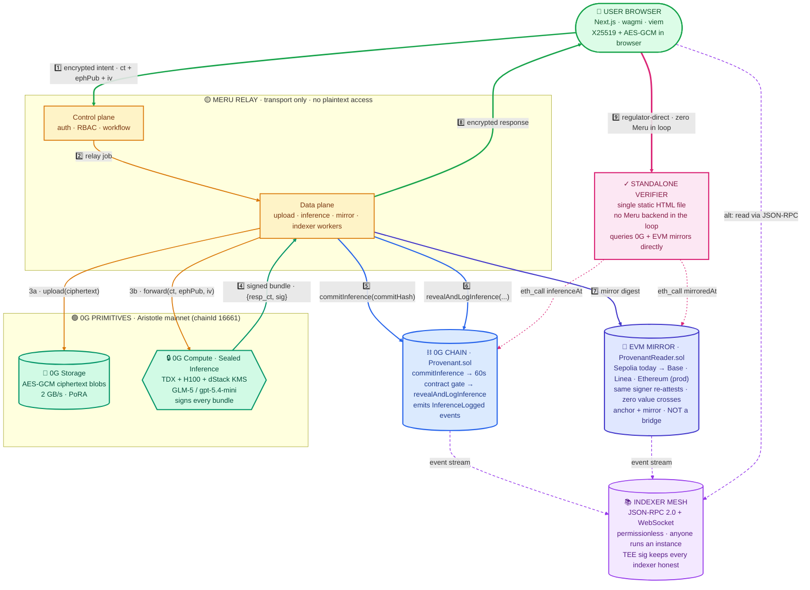
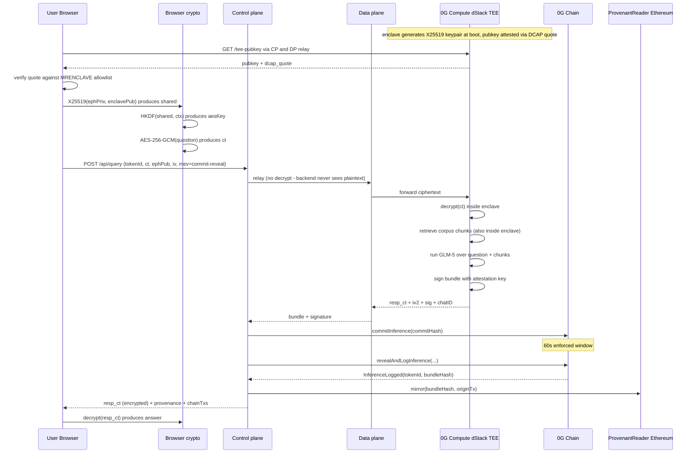
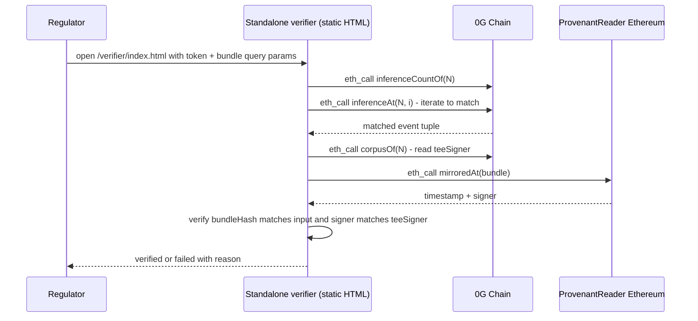

<p align="center">
  
</p>

# Meru — Confidential AI you can prove

> **A PCC-inspired audit substrate for confidential AI on 0G — multi-vendor, on-chain-anchored, regulator-readable.**
> The yardstick is [Apple Private Cloud Compute](https://security.apple.com/blog/private-cloud-compute/); Meru is the open-source, multi-tenant, audit-anchored take. The MVP closes the cryptographic-anchor part of that bar against live mainnet; HSM, multi-attestation, reproducible builds, and enclave-owned signing keys are explicit v2/v3 roadmap work (see [`docs/PRODUCTION-VISION.md`](./docs/PRODUCTION-VISION.md) §3.4).

---

## What you can verify in 60 seconds

| 🔗 What | Where |
|---|---|
| **Live contract** (0G Aristotle mainnet, chain id 16661) | [`0xA8296DfF7C2faD1170e880d71aF92B2F201D30C5`](https://chainscan.0g.ai/address/0xA8296DfF7C2faD1170e880d71aF92B2F201D30C5) |
| **Cross-chain mirror** (`ProvenantReader.sol`, Sepolia) | [`0xA8296DfF7C2faD1170e880d71aF92B2F201D30C5`](https://sepolia.etherscan.io/address/0xA8296DfF7C2faD1170e880d71aF92B2F201D30C5) |
| **Demo video (2:30)** | _(linked at submission)_ |
| **Live demo** | _(Vercel deployment URL at submission)_ |
| **Standalone verifier** | [`/verifier/index.html`](./verifier/index.html) — single static HTML, queries 0G + Sepolia directly, **no Meru backend in the loop** |
| **One-command mainnet smoke** | `cd backend && npm run smoke` — exercises the deployed contract end-to-end in <5 seconds (8/8 green at last run) |
| **Static analysis** | [Slither v0.11.5 report](./contracts/SLITHER-AUDIT.md) — 0 high, 0 medium against Provenant code |

### One-sentence pitch

> Meru is the audit substrate for confidential AI on 0G: encrypted-at-rest corpora, TEE-attested inference, on-chain tamper-evident logs, and cross-chain readability — without a bridge.

---

## §1 — Track 5 sub-theme coverage

Track 5 asks for **privacy-preserving protocols, cross-chain fragmentation solutions, and MEV-resistant infrastructure** for a confidential Web 4.0. Meru ships one load-bearing primitive per pillar, each with an explicit v1-vs-production line.

| Track 5 pillar | What's shipped on mainnet today | Where it lives | v2/v3 production target |
|---|---|---|---|
| **Privacy-preserving protocols** | AES-256-GCM encrypted corpora on 0G Storage · TEE-attested inference on 0G Compute via Phala dStack · ECDSA-signed bundles anchored on 0G Chain | `backend/src/storage/encryptUpload.ts` · `backend/src/inference/seal.ts` · `contracts/Provenant.sol` | Enclave-owned X25519 keys + DCAP browser verification + reproducible-build measurement registry |
| **Cross-chain fragmentation** | Anchor on 0G Chain + re-attest the digest on Sepolia with the same configured signer identity (zero value crosses · no validator quorum · not a bridge) · permissionless JSON-RPC + WebSocket indexer | `contracts/ProvenantReader.sol` · `indexer/` | Multi-chain mirror to Base + Linea + Ethereum L1 · event payload widened so indexer can independently reconstruct TEE-attested truth |
| **MEV-resistant infrastructure** | Client-side X25519 → AES-GCM encrypted intents · on-chain commit-reveal envelope with a **contract-enforced 60-second window** (`block.timestamp >= commit.timestamp + 60`) · 5 backend MEV tests + 15 Hardhat contract tests | `frontend/src/lib/encryptQuery.ts` · `backend/src/mev/shutter.ts` · `Provenant.sol#commitInference` / `revealAndLogInference` | Shutter Network keyper-quorum integration for unspoofable reveal-key release (3-line surface change, scaffolded inline) |

The on-chain commit-reveal gate is what makes the v2 keyper swap safe — **the gate doesn't depend on who holds the key**. The 60s window is real today and survives the swap.

Full sub-theme write-up: [`TRACK-5-COVERAGE.md`](./TRACK-5-COVERAGE.md).

---

## §2 — Current trust boundary (the section a sharp judge will look for)

What you must trust **today**, in v1:

1. **The Phala TEE provider's attestation chain** (Intel TDX + Phala dStack KMS) — `processResponse` from `@0gfoundation/0g-compute-ts-sdk` verifies the provider's chat signature against the on-chain `teeSignerAddress`; the trust root is Intel PCS attestation. Defense-in-depth against [TEE.fail / WireTap (Oct 2025)](./THREAT-MODEL.md) is documented; multi-attestation + reproducible builds are v2.
2. **The Meru backend operator** — *yes, the backend is inside the trust boundary in v1.* Encrypted intents are decrypted at the backend ("bridge mode") before being forwarded to the TEE; the backend's signer signs Provenant digests and Sepolia mirrors under a Level-1 placeholder convention. v2 moves both into enclave-owned keys (see [`docs/E2E-ENCRYPTED-INFERENCE.md`](./docs/E2E-ENCRYPTED-INFERENCE.md)).
3. **The 0G Aristotle validator set** for canonical inclusion of `InferenceLogged` events.
4. **Your wallet** for owning the corpus iNFT and (in v2) signing per-query authorisations.

What you **do not** need to trust in v1:
- The mempool / block builders — encrypted intents + commit-reveal hide the bundle until reveal.
- Any single chain validator — both 0G + Sepolia re-attestations exist, and the permissionless indexer adds a third independent reader.
- The Meru frontend codebase — the standalone verifier (`/verifier/index.html`) reads chains directly, no backend in the loop.

What v1 **does not** claim:
- ❌ "Plaintext never reaches the server" — false in bridge mode.
- ❌ "Only the TEE can decrypt" — bridge mode means the backend can.
- ❌ "Cryptographic proof of zero leakage" — replaced with "tamper-evident provenance + explicit trust-boundary disclosure."
- ❌ "Same TEE signer re-attests on Sepolia" — the same *configured signer identity* re-attests; production moves signing into enclave-owned keys.
- ❌ "Source chunks" as retrieval proof — current values are *corpus blob fingerprints*, not per-chunk retrieval traces.
- ❌ "RevokeEnclave / on-chain key-rotation" — language only, not in contract code today.

Every shipped claim has a verification path; every non-shipped control is labeled roadmap. The full named-assumption list lives in [`THREAT-MODEL.md`](./THREAT-MODEL.md); the production-target boundary lives in [`docs/PRODUCTION-VISION.md`](./docs/PRODUCTION-VISION.md) §3.3.

---

## §3 — Architecture (production reference)

This is the **production-reference** diagram. Sections clearly mark which parts are shipped on mainnet today and which are v2/v3 roadmap — see §5 for the row-by-row matrix.

### §3.1 — Five-layer system, one signed bundle

**Reading guide:**

| Color | Component type | What it means |
|---|---|---|
| 🟢 **Sage green** | User browser | The user's own machine — full trust |
| 🟡 **Amber** | Meru relay (CP + DP) | Transport-only · no plaintext access · what users distrust by default |
| 🟢 **Emerald** | 0G TEE primitives (Storage + Compute) | Cryptographically trusted · enclave-attested |
| 🔵 **Blue** | 0G Chain (Provenant.sol) | On-chain audit anchor · sub-second finality |
| 🟣 **Indigo** | EVM mirror surface | Cross-chain re-attestation · NOT a bridge |
| 🟪 **Violet** | Indexer mesh | Permissionless reader · anyone runs a copy |
| 🩷 **Pink** | Standalone verifier | Static HTML · zero Meru infrastructure in the loop |

| Edge style | Meaning |
|---|---|
| ━━━━ **Green solid (thick)** | Encrypted payload boundary — user ↔ relay (no plaintext crosses) |
| ━━━━ **Amber solid** | Relay-side transport between Meru workers and 0G primitives |
| ━━━━ **Blue solid** | On-chain transactions (anchor + commit-reveal) |
| ━━━━ **Indigo solid** | Cross-chain mirror writes (digest only · no value) |
| ┄┄┄┄ **Violet dashed** | Passive event-stream subscriptions |
| ┄┄┄┄ **Pink dotted** | Public read-only `eth_call` from the verifier |
| ════ **Pink double** | Regulator path that bypasses Meru entirely |

Numbered edges 1️⃣–9️⃣ are the inference data flow. **Edge 9️⃣ is the demo punchline:** the regulator path that touches zero Meru infrastructure.



**How to read this in 30 seconds:**

1. **Top-to-bottom is the inference path.** A user encrypts a question in their browser (green box at top), it flows through the Meru relay (amber, transport-only), reaches the 0G TEE primitives (emerald — this is where the cryptographic trust lives), and the answer is signed inside the enclave.
2. **The signed bundle then anchors on-chain** (blue — 0G Chain via commit-reveal) and **mirrors cross-chain** (indigo — EVM mirror).
3. **Two read-side surfaces** sit at the bottom: the indexer mesh (violet, permissionless) and the standalone verifier (pink, static HTML).
4. **The pink double-arrow (edge 9️⃣)** is the punchline — a regulator goes from their browser straight to the verifier, queries 0G + EVM mirrors directly, and confirms a bundle without ever touching Meru's infrastructure.

The amber relay zone is what the buyer is asked to **not** trust. The green/emerald/blue zones are where the cryptographic chain anchors trust. The pink zone proves you don't need to trust us.

### §3.1 — ASCII fallback (for terminal viewers / Mermaid-less renderers)

```text
                  ┌──────────────────────────────────────────────────┐
                  │  👤  USER · BROWSER                              │
                  │    Next.js · wagmi v2 · viem                     │
                  │    X25519 keypair + AES-256-GCM in-browser       │
                  └──┬─────────────────────────────────────────┬─────┘
                     │ 1️⃣ encrypted intent                       │ 9️⃣ regulator-side
                     │   {ct, ephPub, iv}                        │   verify directly
                     ▼                                           │   (no Meru backend)
   ╔═════════════════════════════════════════════╗               │
   ║  🚇  MERU RELAY · transport-only · no       ║               │
   ║      plaintext access                       ║               │
   ║  ┌───────────────────────────────────────┐  ║               │
   ║  │ Control plane (auth · RBAC · workflow │  ║               │
   ║  │ orchestration · signer governance)    │  ║               │
   ║  └─────────────────┬─────────────────────┘  ║               │
   ║                    │  2️⃣ relay job          ║               │
   ║                    ▼                        ║               │
   ║  ┌───────────────────────────────────────┐  ║               │
   ║  │ Data plane (upload · inference ·      │  ║               │
   ║  │ mirror · indexer workers)             │  ║               │
   ║  └──┬─────────┬─────────────┬─────────┬──┘  ║               │
   ╚═════│═════════│═════════════│═════════│═════╝               │
         │ 3a      │ 3b          │ 7️⃣     │ 8️⃣                  │
         ▼         ▼             │       (encrypted              │
   ┌──────────┐ ┌──────────────┐ │        response back          │
   │💾 0G     │ │🔒 0G COMPUTE │ │         to user)              │
   │ STORAGE  │ │ Sealed Inf   │ │                                │
   │ AES-GCM  │ │ TDX+H100     │ │                                │
   │ rootHash │ │ + dStack KMS │ │                                │
   └──────────┘ └──────┬───────┘ │                                │
                       │ 4️⃣ signed bundle                         │
                       │   {resp_ct, sig, chatID}                 │
                       ▼                                          │
                ┌──────────────────────────────────────┐          │
                │⛓ 0G CHAIN · Aristotle (chainId 16661)│          │
                │  Provenant.sol                       │          │
                │  • commitInference(commitHash)       │◄─────────┘
                │     ⏳ 60s contract-enforced gate    │   (eth_call only)
                │  • revealAndLogInference(...)        │
                │  → InferenceLogged event             │
                └──────┬───────────────────┬───────────┘
                       │ event stream      │ 7️⃣ mirror digest
                       ▼                   ▼
                ┌──────────────┐  ┌────────────────────────────┐
                │📚 INDEXER    │  │📡 ProvenantReader.sol      │
                │ MESH         │  │  on Sepolia (v1) →         │
                │ JSON-RPC+WS  │◄─┤  Base + Linea + Ethereum   │
                │ permission-  │  │  (prod)                    │
                │ less         │  │  same signer re-attests    │
                └──────────────┘  │  zero value crosses        │
                                  └────────────────────────────┘
                                       │
                                       ▼
                              ┌─────────────────────┐
                              │✓ STANDALONE         │
                              │  VERIFIER WIDGET    │
                              │  static HTML        │
                              │  no backend in loop │
                              └─────────────────────┘

Color → trust posture key:
  🟢 sage    → cryptographically trusted (TEE + chains)
  🟡 amber   → transport-only relay (no plaintext, no signing keys)
  🟣 purple  → permissionless reader infrastructure
  🩷 pink    → trust-neutral verifier (no infra in the loop at all)
```

### §3.2 — Component map at a glance

| Component | Where it lives | Trust posture (production) | What it actually does |
|---|---|---|---|
| User browser | Client-side | User trusts themselves | X25519 key generation, AES-GCM, wallet signing |
| Control plane | Meru cluster (k8s, multi-region) | Transport-only · no plaintext | Auth, RBAC, workflow orchestration, audit APIs |
| Data plane | Meru cluster | Transport-only · stateless | Upload / inference / mirror / indexer workers |
| 0G Storage | 0G PoRA-incentivised storage nodes | Cryptographically trusted | AES-GCM ciphertext blob persistence, rootHash returns |
| 0G Compute (Sealed Inference) | Phala dStack TEE (TDX + H100) | Cryptographically trusted via TEE attestation | Decrypts ciphertext inside enclave, runs model, signs bundle |
| 0G Chain (Provenant.sol) | 0G Aristotle mainnet, chainId 16661 | Cryptographically trusted via validator set | `commitInference` / `revealAndLogInference` with on-chain 60s gate |
| ProvenantReader (mirror) | Sepolia (v1) → Base/Linea/Ethereum (prod) | Cryptographically trusted via EVM validator sets | Re-attests `bundleHash` with chain-bound digest |
| Indexer mesh | Anyone runs an instance | Permissionless **read replica of the source-chain log** | JSON-RPC + WS + multi-chain relayer |
| Standalone verifier | Static HTML on GitHub Pages | Zero infrastructure in trust path | Queries chains directly, recomputes digest, ✓ or ✗ |

---

## §4 — The complete tech stack (9 layers)

Two views: a layered stack diagram, then a categorised inventory. Everything below the dotted line is what we depend on; everything above is what Meru ships.

```mermaid
flowchart TB
    classDef ourLayer fill:#DCFCE7,stroke:#6FA58A,stroke-width:2.5px,color:#14532D
    classDef chainLayer fill:#DBEAFE,stroke:#5B7FFF,stroke-width:2px,color:#1E3A8A
    classDef cryptoLayer fill:#FCE7F3,stroke:#BE185D,stroke-width:2px,color:#831843
    classDef runtimeLayer fill:#FEF3C7,stroke:#C9A86A,stroke-width:1.5px,color:#78350F
    classDef hardwareLayer fill:#E0E7FF,stroke:#4338CA,stroke-width:2px,color:#312E81
    classDef stdLayer fill:#F3F4F6,stroke:#6B7280,stroke-width:1px,color:#374151

    subgraph L1 ["🎨 1 · Application surface · what users see"]
        APP1["Chat UI · Next.js 16<br>App Router · React 19"]:::ourLayer
        APP2["Verifier widget<br>vanilla HTML · no SDK"]:::ourLayer
        APP3["Auditor view<br>read-only audit log"]:::ourLayer
        APP4["Agent surfaces (v2+)<br>tool calls · memory · MCP"]:::ourLayer
    end

    subgraph L2 ["🧠 2 · Domain logic · Meru's IP"]
        DOM1["Sealed Inference SDK<br>backend/src/inference/seal.ts<br>broker SDK + sig verify"]:::ourLayer
        DOM2["Encrypted intents<br>X25519 → HKDF → AES-GCM"]:::ourLayer
        DOM3["Commit-reveal wrapper<br>Shutter-shaped envelopes"]:::ourLayer
        DOM4["Audit anchor protocol<br>signed bundle wire format"]:::ourLayer
        DOM5["Indexer service<br>JSON-RPC + WS + relayer"]:::ourLayer
    end

    subgraph L3 ["🛡 3 · Smart contracts · on-chain primitives"]
        SC1["Provenant.sol on 0G<br>ERC-721 + commit-reveal<br>InferenceLogged events"]:::chainLayer
        SC2["ProvenantReader.sol on EVM<br>cross-chain re-attestation<br>chain-bound digests"]:::chainLayer
        SC3["Attestation registry (v2)<br>EnrollEnclave + RevokeEnclave"]:::chainLayer
    end

    subgraph L4 ["🔐 4 · Cryptography · primitives only, no rolled crypto"]
        CR1["AES-256-GCM (AEAD)<br>via Node crypto + @noble/ciphers"]:::cryptoLayer
        CR2["X25519 ECDH<br>via @noble/curves"]:::cryptoLayer
        CR3["HKDF-SHA-256<br>via @noble/hashes"]:::cryptoLayer
        CR4["ECDSA / secp256k1<br>via ethers + OZ MessageHashUtils"]:::cryptoLayer
        CR5["EIP-712 typed data<br>via wagmi signTypedData"]:::cryptoLayer
        CR6["DCAP attestation verification (v2)<br>via @phala/dcap-qvl-web"]:::cryptoLayer
    end

    subgraph L5 ["⚡ 5 · 0G primitives · platform layer"]
        ZG1["0G Storage<br>2 GB/s · PoRA<br>@0glabs/0g-ts-sdk"]:::chainLayer
        ZG2["0G Compute · Sealed Inference<br>broker SDK<br>@0gfoundation/0g-compute-ts-sdk"]:::chainLayer
        ZG3["0G Chain · Aristotle 16661<br>CometBFT · sub-second finality"]:::chainLayer
        ZG4["0G DA (v2 · for batched audit-log Merkle roots)"]:::chainLayer
    end

    subgraph L6 ["🌐 6 · EVM mirror surface · cross-chain readability"]
        EVM1["Sepolia (today)"]:::chainLayer
        EVM2["Base Mainnet (prod)"]:::chainLayer
        EVM3["Linea Mainnet (prod)"]:::chainLayer
        EVM4["Ethereum L1 (prod)"]:::chainLayer
    end

    subgraph L7 ["🚇 7 · Runtime · the boring middle"]
        RT1["Node 22 · TypeScript strict"]:::runtimeLayer
        RT2["Express · Zod input validation"]:::runtimeLayer
        RT3["Pino structured logging"]:::runtimeLayer
        RT4["Helmet + rate-limit middleware"]:::runtimeLayer
        RT5["Temporal / Inngest (v2 · durable jobs)"]:::runtimeLayer
        RT6["Postgres + Redis (v2 · indexer scale)"]:::runtimeLayer
    end

    subgraph L8 ["🔒 8 · Confidential-compute hardware · the trust root"]
        HW1["Intel TDX<br>confidential VM"]:::hardwareLayer
        HW2["NVIDIA H100 / H200<br>confidential GPU mode"]:::hardwareLayer
        HW3["Phala dStack KMS<br>MRENCLAVE-bound app keys"]:::hardwareLayer
        HW4["AMD SEV-SNP (v3 · second-vendor attestation)"]:::hardwareLayer
    end

    subgraph L9 ["📐 9 · Standards · what we conform to"]
        STD1["ERC-721 (corpus iNFT)"]:::stdLayer
        STD2["ERC-7857 (iNFT shim today, full inheritance v2)"]:::stdLayer
        STD3["EIP-191 (signature prefix)"]:::stdLayer
        STD4["W3C VC v2.0 (regulator-facing v2)"]:::stdLayer
        STD5["Sigstore / Rekor (audit-log pattern reference)"]:::stdLayer
        STD6["JSON-RPC 2.0 (indexer API)"]:::stdLayer
    end

    L1 --> L2
    L2 --> L3
    L2 --> L4
    L3 --> L5
    L3 --> L6
    L2 --> L7
    L5 --> L8
    L3 -.- L9
```



Full categorised inventory (every package, every version, every replacement decision): [`docs/PRODUCTION-VISION.md`](./docs/PRODUCTION-VISION.md) §3.5.

---

## §5 — What's shipped vs production target

The most important section for an honest evaluation. The MVP closes the **cryptographic-anchor** part of the PCC yardstick; the operational and runtime parts are explicit roadmap work.

### §5.1 — PCC requirement mapping

| PCC requirement | Meru v1 (today, on mainnet) | Meru production target |
|---|---|---|
| **Stateless Computation** | ⚠️ Backend caches extracted PDF text encrypted-at-rest for grounding | 🎯 Enclave is stateless per call; corpus decryption happens inside the enclave at query time |
| **Enforceable Guarantees** | ⚠️ Single-vendor TEE attestation (Intel TDX via Phala); no on-chain revocation | 🎯 Multi-attestation (Intel TDX + AMD SEV-SNP) + reproducible builds + `RevokeEnclave` / `EnrollEnclave` events |
| **Verifiable Transparency** | ⚠️ Audit log on-chain; enclave is a 0G black box (no reproducible-build pipeline) | 🎯 Anchor + mirror + permissionless indexer mesh + standalone verifier + binary transparency log |
| **Non-Targetability** | ⚠️ Encrypted intents in bridge mode (backend decrypts); commit-reveal MEV gate is real | 🎯 Enclave-owned X25519 + commit-reveal + per-corpus HSM-backed key isolation |
| **No Privileged Runtime Access** | ⚠️ Backend holds signing keys (Level-1 placeholder); decrypts encrypted intents | 🎯 Backend = transport only; signing + decryption inside the enclave |

Apple PCC is **closed-source, single-vendor, single-tenant**. Meru's distinguishing value isn't beating PCC on any of these requirements today — it's that the architecture is **multi-vendor, multi-tenant, regulator-readable, and open-source**, with the same set of requirements as the yardstick.

### §5.2 — Roadmap maturity matrix

| Capability | v1 status (this submission) | v2 target | v3 target |
|---|---|---|---|
| TEE attestation signer | Level-1 placeholder (deployer wallet) | Enclave generates X25519 keypair at boot via dStack KMS; pubkey attested via DCAP quote | Multi-attestation quorum (TDX + SEV-SNP) |
| Encrypted intents | Bridge mode — backend decrypts before forwarding to TEE | Enclave-owned key + DCAP browser verification — backend becomes pure transport | Per-corpus HSM-backed isolation |
| Document encryption | Server-side AES-GCM with HKDF subkeys | Browser-side encryption with user-wallet-derived keys | KMS-rooted per-tenant key hierarchy |
| MEV gate | On-chain 60s window (real) + in-memory threshold scaffold | Real Shutter Network keyper-quorum integration (3-line surface change scaffolded) | Threshold-quorum + Flashbots-SUAVE-style ordering |
| ERC-7857 | `supportsInterface(0x78570001)` shim | Full inheritance via storage-layout refactor | Soulbound variant for compliance-grade buyers |
| Indexer | Single-process, SQLite, read replica of source-chain log | Postgres + Redis + multi-region; event payload widened to carry TEE sig inline | Trillian-backed Merkle log (Sigstore-style) |
| Signer key custody | Single `.env` master + HKDF subkeys | AWS KMS / HashiCorp Vault + HSM-backed signing | Per-corpus HSM partitions |
| Workflow orchestration | Inline async/await; 61s synchronous wait on commit-reveal | Temporal.io / Inngest (durable jobs) | Multi-region failover with replay |
| Multi-tenant RBAC | Not present (single-team demo) | Auth0 / Clerk + tenant scopes | Per-org audit-role separation |

This is the same matrix the MVP doc commits to. Full per-row rationale + effort estimates: [`docs/PRODUCTION-VISION.md`](./docs/PRODUCTION-VISION.md) §8 and [`docs/HACKATHON-MVP.md`](./docs/HACKATHON-MVP.md) §3.

---

## §6 — Sequence diagrams (the load-bearing paths)

The query path (production target, with enclave-owned key) and the auditor path (regulator-side verification) are the two flows that decide whether the architecture works. Both diagrams below are the same as in [`docs/PRODUCTION-VISION.md`](./docs/PRODUCTION-VISION.md) §4.

### §6.1 — Query (production target — true end-to-end E2E)



**What's different in v1:** the backend ("bridge mode") decrypts `ct` before forwarding plaintext to the TEE, and a single Level-1 placeholder signer signs the bundle outside the enclave. Everything from `commitInference(...)` downward — the 60s on-chain gate, the InferenceLogged event, the Sepolia mirror — is live on mainnet today.

### §6.2 — Audit (regulator-side verification, no Meru involvement)



This is the moment that closes the regulator's evaluation: *"I verified this myself, in my browser, against two independent chains, without touching Meru's infrastructure."*

Two more sequence diagrams (upload + mint, and key rotation / revocation) live in [`docs/PRODUCTION-VISION.md`](./docs/PRODUCTION-VISION.md) §4.1 and §4.4.

---

## §7 — 0G integration depth

Meru uses **three load-bearing 0G layers** plus an iNFT-standard advertisement. Removing any one breaks the product.

| 0G layer | Provenant code path | Used for |
|---|---|---|
| **0G Storage** | `backend/src/storage/encryptUpload.ts` via `@0glabs/0g-ts-sdk` | AES-256-GCM ciphertext blob upload; never plaintext. Returns `rootHash` (CID) recorded in the iNFT. |
| **0G Compute (Sealed Inference)** | `backend/src/inference/seal.ts` via `@0gfoundation/0g-compute-ts-sdk@^0.8.3` | TDX-attested LLM inference. The signed chat reply is verified through `processResponse` against the on-chain `teeSignerAddress`. Provider: Phala TEE @ `0x25F8f01cA76060ea40895472b1b79f76613Ca497` running `gpt-5.4-mini` at `dstack-pha-prod5.phala.network`. |
| **0G Chain (Aristotle, chain 16661)** | `contracts/Provenant.sol` | ERC-721 iNFT + `logInference(...)` + `commitInference` / `revealAndLogInference` MEV-resistance hooks. Live at [`0xA8296DfF…30C5`](https://chainscan.0g.ai/address/0xA8296DfF7C2faD1170e880d71aF92B2F201D30C5). |
| **0G ecosystem alignment** | — | **ERC-7857 iNFT compatibility** advertised via `supportsInterface(0x78570001)` (full inheritance is v2 storage-layout work). Built against [0G's Sealed Inference launch (March 2026)](https://0g.ai/blog/0g-private-computer) and the [Phala × 0G partnership](https://phala.com/posts/phala-network-and-0g-partner-for-enhanced-confidential-ai-computing). |

Innovation: Meru combines the three 0G primitives into a **single signed-bundle wire format** that is independently verifiable from on-chain data alone, with no Meru infrastructure required. The novelty isn't using each primitive — it's the **composition into an audit substrate** that survives the operator.

---

## §8 — What Meru ships (5 protocol components + 1 reference UI + 1 standalone verifier)

| # | Component | Where | What it is |
|---|---|---|---|
| 1 | **Audit Anchor Protocol** | `contracts/Provenant.sol` + `ProvenantReader.sol` | The on-chain primitive. ERC-721-based corpus iNFT on 0G + Sepolia mirror. Signed-bundle wire format. Replay-protected via `block.chainid` + per-corpus enclave signer. |
| 2 | **Sealed-Inference-as-a-Service SDK** | `backend/src/inference/seal.ts` + `storage/encryptUpload.ts` | Drives 0G Storage + 0G Sealed Inference + 0G Chain together. AES-256-GCM at rest, HKDF per-corpus keys, ECDSA + EIP-712 signing. |
| 3 | **Encrypted-Intents Pattern** | `frontend/src/lib/encryptQuery.ts` | Client-side X25519 → AES-GCM encryption of the query bound to the enclave's KEM key. Defends against *informational MEV* — the mempool sees only ciphertext. |
| 4 | **Commit-Reveal Wrapper (Shutter-shaped)** | `backend/src/mev/shutter.ts` + `Provenant.sol` | Wraps `logInference(...)` calldata in a commit-reveal envelope with on-chain 60s gate. Production swap-in for the Shutter Network keyper API is documented inline. |
| 5 | **Audit-Log Indexer** | `indexer/` (standalone package) | Permissionless Node.js service: JSON-RPC + REST + WebSocket feed of every Provenant event. Multi-destination relayer pushes to any number of EVM chains. The cross-chain fragmentation primitive. |

The chat UI in `frontend/` is a **reference application** — not the product. The product is the protocol: signed-bundle format + audit-anchor contract + indexer + verifier.

**The standalone verifier (`verifier/index.html`) is the most important artifact for the trust claim.** Single static HTML file, no SDK, no Meru backend in the loop. Paste a tokenId + bundleHash from any Meru audit entry, and it queries 0G Aristotle and Sepolia *directly* to verify the bundle was honestly anchored. A regulator with nothing but a browser can verify any Meru inference against the live chains without trusting the project.

---

## §9 — How this maps to the judging criteria

| Criterion | How Meru lands |
|---|---|
| **0G Technical Integration Depth & Innovation** | Three load-bearing 0G layers (Storage + Compute + Chain) plus the ERC-7857 iNFT-standard advertisement. The **composition** into a signed-bundle wire format that is independently verifiable from on-chain data alone is the innovation. Sealed Inference is wired via the canonical SDK and verified through `processResponse` against the on-chain `teeSignerAddress`. |
| **Technical Implementation & Completeness** | Provenant.sol live on 0G Aristotle mainnet at [`0xA8296DfF…30C5`](https://chainscan.0g.ai/address/0xA8296DfF7C2faD1170e880d71aF92B2F201D30C5); Sepolia mirror at the same address. 15 Hardhat contract tests passing; 5 backend MEV tests; Slither (49 informational, 0 high, 0 medium); both projects typecheck clean (TS strict). `npm run smoke` exercises the deployed contract end-to-end. |
| **Product Value & Market Potential** | Buyer pain: every regulated AI deployment in 2026-27 needs tamper-evident provenance (EU AI Act Article 12, India DPDPA Rules 2025, RBI FREE-AI committee report — see [`docs/PRODUCTION-VISION.md`](./docs/PRODUCTION-VISION.md) Appendix for precise citations). 97% of AI-breach victims can't produce one ([IBM 2025](https://www.ibm.com/reports/data-breach)). Growth path: wedge today (regulated AI buyers in APAC FSI) → audit-substrate-as-a-service → multi-tenant SaaS in v3. |
| **User Experience & Demo Quality** | Light-mode-first "AI notary" UI register, document-oriented (not "crypto-app"). Standalone verifier is one HTML file anyone can open. Demo punchline: pipe an inference from question → encrypted intent → TEE → 60s on-chain gate → reveal → Sepolia mirror → regulator opens verifier widget → ✓ — without ever touching Meru's backend. PipelineTracker UI ticks only on real backend signals (the contract-enforced 60s window), never on fake setInterval cadence. |
| **Team Capability & Documentation** | Solo build, MIT-licensed, all artifacts open from day 1. Documentation is structured so judges can read the README → drop into [`docs/HACKATHON-MVP.md`](./docs/HACKATHON-MVP.md) for what's actually shipped → drop into [`docs/PRODUCTION-VISION.md`](./docs/PRODUCTION-VISION.md) for the production target → [`THREAT-MODEL.md`](./THREAT-MODEL.md) for named assumptions. Every shipped claim has a verification path; every non-shipped control is labeled roadmap. |

---

## §10 — Threat model summary

**What Meru trusts in v1:**
- The 0G Sealed Inference enclave's TDX attestation key (Intel TDX + NVIDIA H100 hardware root-of-trust, verified through Phala's dStack KMS chain)
- The 0G Aristotle validator set for ordering and finality of audit-log events
- The user's wallet for ownership of the corpus iNFT
- The Meru backend operator (bridge-mode trust boundary — collapses to transport-only in v2)

**What Meru does NOT trust:**
- The inference-node operator (cannot read plaintext through the TEE, cannot tamper with attestation)
- The Storage operator (cannot decrypt the ciphertext)
- Any individual chain validator (consensus is over the Byzantine validator set, and both 0G + Sepolia re-attestations exist)
- The mempool / block builders (encrypted intents + on-chain commit-reveal defend against informational MEV and reordering)

**TEE side-channel response — defence in depth, not denial.** [Battering RAM (Sept 2025)](https://thehackernews.com/2025/10/50-battering-ram-attack-breaks-intel.html) and [TEE.fail (Oct 2025)](https://tee.fail/files/paper.pdf) demonstrated that current TEE primitives (SGX, TDX, SEV-SNP, NVIDIA Confidential Computing) are vulnerable to physical memory-bus interposition. Meru's response:

1. **Ephemeral unwrapping keys.** Ciphertext at rest is AEAD-encrypted with HKDF-derived per-corpus keys; a compromised enclave instance can't retroactively decrypt past corpora.
2. **Bundle-level binding.** Every signed bundle includes `enclaveId + block.chainid + address(this) + enclaveTimestamp` — a forged TDX quote on one instance can't replay against another corpus's audit log.
3. **Revocation on detection (v2).** On-chain `RevokeEnclave` events let any post-revoke log entry signed by a revoked key be auditable as invalid.

Meru is not "TEE-proof"; it is **"audit-substrate-correct even when TEE is partially compromised."** Full threat model and named assumptions: [`THREAT-MODEL.md`](./THREAT-MODEL.md).

---

## §11 — Static analysis (Slither)

[Slither v0.11.5](https://github.com/crytic/slither) was run against `contracts/` on 2026-05-14. Result: **49 informational findings, 0 high-severity, 0 medium-severity, 0 issues against Provenant code.**

All Provenant-side findings reduce to two expected `block.timestamp` uses (the replay-window bound and the reveal-delay gate), both intentional and orthogonal to access control. OpenZeppelin-side findings are inline assembly + dead-code in the audited base library (accepted). Full categorised report: [`contracts/SLITHER-AUDIT.md`](./contracts/SLITHER-AUDIT.md).

Reproduce:

```bash
cd contracts
pip3 install --user slither-analyzer && solc-select install 0.8.20 && solc-select use 0.8.20
slither contracts/ --solc-remaps "@openzeppelin/=node_modules/@openzeppelin/"
```

---

## §12 — Repository layout

```
provenant/
├── contracts/   Hardhat · Solidity 0.8.20 · OpenZeppelin v5.0.2 · 15 tests
│   ├── Provenant.sol         Corpus iNFT (ERC-721) + InferenceLogged events
│   │                         + commitInference / revealAndLogInference (60s gate)
│   ├── ProvenantReader.sol   Cross-chain mirror (NOT a bridge)
│   └── SLITHER-AUDIT.md      0 high · 0 medium against Provenant code
│
├── backend/     Sealed-Inference SDK
│   ├── crypto/keys.ts        AES-256-GCM · HKDF · CSPRNG IVs
│   ├── storage/encryptUpload Encrypt → upload to 0G Storage
│   ├── inference/seal.ts     Sealed Inference call + signed bundle verification
│   ├── mirror/sepolia.ts     Anchor + mirror to Sepolia
│   ├── mev/shutter.ts        Commit-reveal wrapper (Shutter Network swap planned)
│   └── routes/               /mint /upload /query /audit + /health
│
├── frontend/    Reference UI · Next.js 16 · Tailwind 4 · viem · wagmi v2
│   ├── app/page.tsx          Empty state · hero · composer
│   ├── app/corpus/[id]/      Chat-thread workspace per corpus
│   ├── app/audit/[id]/       Public auditor view (no auth)
│   └── lib/encryptQuery.ts   Client-side X25519 → AES-GCM encrypted intents
│
├── indexer/     Standalone audit-log mirror · JSON-RPC + REST + WS
│   ├── poller.ts             Polls 0G Aristotle for events
│   ├── relayer.ts            Multi-destination EVM relayer (KelpDAO-anti-pattern guarded)
│   └── rpc.ts                JSON-RPC 2.0 + REST + /health
│
├── verifier/    Standalone HTML verifier (no SDK, no backend)
│   └── index.html            Queries 0G + Sepolia directly via eth_call
│
└── docs/
    ├── PRODUCTION-VISION.md         Production target (v3) — what makes the wedge fundable
    ├── HACKATHON-MVP.md             What's shipped on mainnet today (v1)
    ├── MERU-VS-PCC-VS-DSTACK.md     Apple PCC ↔ Meru ↔ Phala dStack comparison
    ├── E2E-ENCRYPTED-INFERENCE.md   v2 enclave-owned-key plan
    ├── INTEGRATING-0G-SEALED-INFERENCE.md  Wiring the canonical SDK
    ├── WHY-MERU.md                  Naming + positioning rationale
    └── WHAT-MERU-SOLVES.md          Plain-English product thesis
```

---

## §13 — Quick start

The repo is three independent packages plus the indexer; each has its own `.env.example`. **Never commit `.env`** — credentials load from environment variables only.

```bash
git clone <this-repo>
cd provenant

# 1. Contracts — compile + test (offline, no credentials needed)
cd contracts && cp .env.example .env && npm install
npx hardhat compile && npx hardhat test     # 15 tests pass

# 2. Backend — runs in stub mode without 0G credentials
cd ../backend && cp .env.example .env && npm install
npm run dev                                  # http://localhost:8787/health

# 3. Frontend — chat UI
cd ../frontend && cp .env.example .env.local && npm install
npm run dev                                  # http://localhost:3000

# 4. Indexer — point at the deployed Provenant.sol once you have its address
cd ../indexer && cp .env.example .env && npm install
# set PROVENANT_CONTRACT_ADDRESS in .env (env var, never hardcoded)
npm run dev                                  # http://localhost:8788/health
```

When `.env` carries real 0G credentials, the stubs flip to real 0G Storage + Sealed Inference + Chain calls automatically. The backend refuses to anchor on the real chain when the inference falls back to stub (the `bundle.stub === true` gate in `query.ts`) — so the chain never carries a misleading audit row.

### Mainnet smoke test

```bash
cd backend && npm run smoke
```

Exercises every eligibility-critical contract call against the deployed 0G Aristotle contract in <5 seconds. Last run: 8/8 green.

---

## §14 — JSON-RPC against the indexer

```bash
# every inference for a corpus
curl -X POST http://localhost:8788/rpc \
  -H 'Content-Type: application/json' \
  -d '{"jsonrpc":"2.0","id":1,"method":"provenant_getInferences","params":["42",100]}'

# look up by bundle hash
curl -X POST http://localhost:8788/rpc \
  -H 'Content-Type: application/json' \
  -d '{"jsonrpc":"2.0","id":1,"method":"provenant_getInferenceByBundle","params":["0xabcd…"]}'

# WebSocket push of every new event
wscat -c ws://localhost:8788/ws/events
```

The indexer is a **permissionless read replica of the authoritative source-chain log**, not an independent attestation. Today's `InferenceLogged` event carries `(tokenId, bundleHash, questionHash, timestamp)`; the TEE signature on the corresponding anchor digest is supplied to relayers out-of-band by the backend, so an auditor's full trust path is: indexer → source-chain event match → TEE-sig verification against on-chain `teeSignerAddress`. v2 widens the event payload to carry the TEE signature inline so indexers can independently reconstruct TEE-attested truth from event data alone.

---

## §15 — What Meru is NOT

- Not a decisioning engine — model outputs are reference-only; the operator's existing systems decide.
- Not a mixer / privacy-coin / value-private bridge.
- Not a cross-chain bridge — the mirror is event re-attestation only, zero value moves.
- Not a DEX MEV product — informational MEV / encrypted intents is the angle (see [`TRACK-5-COVERAGE.md`](./TRACK-5-COVERAGE.md) §3).
- Not a token / yield / airdrop product.

It is **infrastructure**: a Sealed-Inference SDK, an audit-anchor protocol, a permissionless indexer, an encrypted-intents pattern, and a commit-reveal wrapper. The chat UI demonstrates them; it isn't the product.

---

## §16 — Documents (read in this order)

1. **This README** — judges' first surface after the demo video.
2. [`TRACK-5-COVERAGE.md`](./TRACK-5-COVERAGE.md) — sub-theme by sub-theme coverage statement.
3. [`docs/HACKATHON-MVP.md`](./docs/HACKATHON-MVP.md) — what's actually shipped on mainnet today (v1).
4. [`docs/PRODUCTION-VISION.md`](./docs/PRODUCTION-VISION.md) — production target (v3) with full architecture, sequence diagrams, 9-layer stack, roadmap, commercial path.
5. [`THREAT-MODEL.md`](./THREAT-MODEL.md) — named assumptions + TEE side-channel response.
6. [`docs/MERU-VS-PCC-VS-DSTACK.md`](./docs/MERU-VS-PCC-VS-DSTACK.md) — Apple PCC ↔ Meru ↔ Phala dStack mapping.
7. [`docs/E2E-ENCRYPTED-INFERENCE.md`](./docs/E2E-ENCRYPTED-INFERENCE.md) — v2 enclave-owned-key plan.
8. [`docs/INTEGRATING-0G-SEALED-INFERENCE.md`](./docs/INTEGRATING-0G-SEALED-INFERENCE.md) — wiring against `@0gfoundation/0g-compute-ts-sdk`.
9. [`docs/WHAT-MERU-SOLVES.md`](./docs/WHAT-MERU-SOLVES.md) — plain-English product thesis.
10. [`docs/WHY-MERU.md`](./docs/WHY-MERU.md) — naming + positioning rationale.

---

## §17 — License & naming note

MIT licensed — see [LICENSE](./LICENSE). Contributing guide: [CONTRIBUTING.md](./CONTRIBUTING.md).

**Renamed from "Provenant" to "Meru" on 2026-05-15.** Mount Meru is the axis mundi of South and East Asian cosmologies — the fixed centre around which order is organised. The product's role is the same: a stable cryptographic centre that anchors how an AI handled private data, so independent parties can verify it without trusting us. The on-chain contract, npm packages, sessionStorage keys, JSON-RPC method namespace, and most code symbols still carry "provenant" — those are stable wire-format contracts and can't be renamed without breaking deployed artifacts. Full rationale: [`docs/WHY-MERU.md`](./docs/WHY-MERU.md).

---

*Meru — confidentiality infrastructure for AI on 0G. Solo build for the 0G APAC Hackathon, Track 5: Privacy & Sovereign Infrastructure.*
