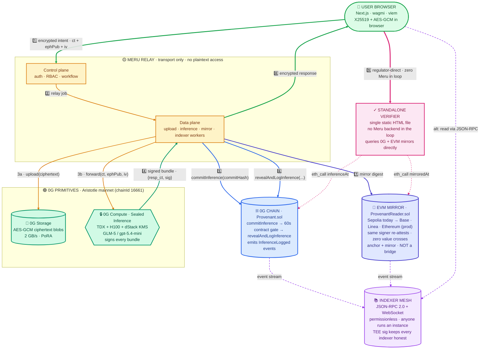
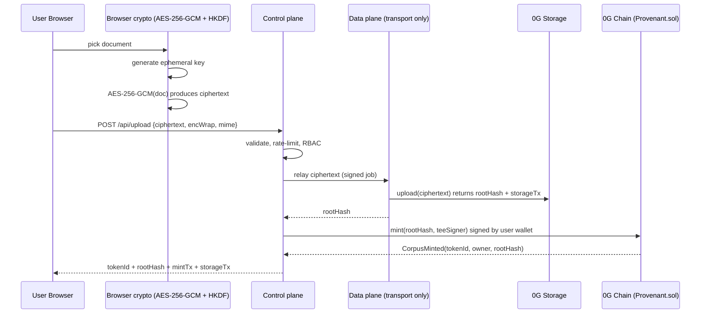
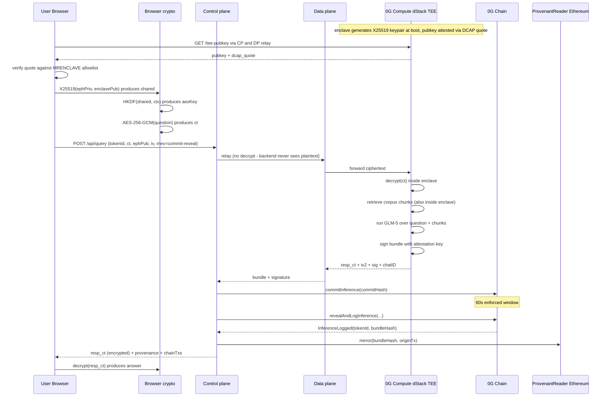
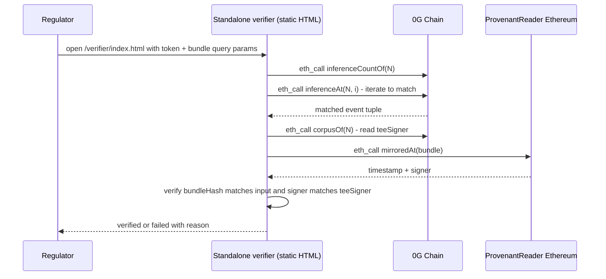
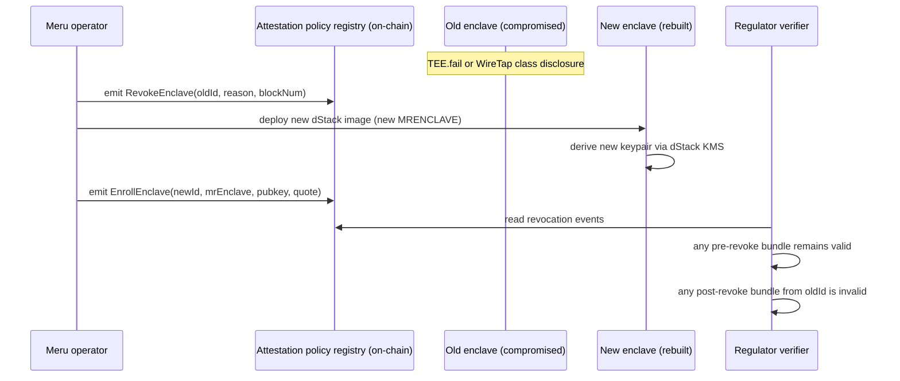

# Meru — Production Vision

### The confidentiality rails for Web 4.0 confidential AI

**Track 5 alignment.** This document is Meru's answer to the Track 5 problem statement: *"Building the confidentiality rails and abstraction layers for a secure Web 4.0 and developing privacy-preserving protocols, cross-chain fragmentation solutions, and MEV-resistant infrastructure."*

What follows is the battle-tested system Meru is designed to *become* — not what was shipped in 5 days. The 5-day MVP is documented separately in [`HACKATHON-MVP.md`](./HACKATHON-MVP.md). This doc is the architecture, the market thesis, the novelty, the stack, the threat model, and the roadmap that the MVP is a deliberate slice of.

---

## §1 — Executive thesis

**The Web 4.0 confidentiality problem in one sentence.** AI is being deployed against the most sensitive data humans hold — medical records, bank statements, legal contracts, classified communications — on infrastructure none of those data holders can audit. The next wave of AI will be defined by who can *prove* what their AI did, not by who shipped first.

**Meru's wedge.** A vendor-neutral audit substrate that turns every TEE-attested inference call into a tamper-evident cryptographic receipt, anchored on-chain, cross-chain readable, and verifiable by a regulator with nothing more than a browser. Not a wrapper. Not a SaaS. A protocol.

**The single sentence to remember.**

> Meru is the open-source, decentralized, on-chain-anchored equivalent of [Apple Private Cloud Compute](https://security.apple.com/blog/private-cloud-compute/) — for regulated industries.

Apple PCC defined the canonical 5-requirement architecture for confidential AI inference. Apple's instance is closed-source, single-vendor, single-tenant, and consumer-facing. Meru is the multi-vendor, multi-tenant, permissionless, enterprise-grade version of the same five requirements — built on the 0G stack.

---

## §2 — The market need (why now)

### §2.1 — Three regulatory cliffs the buyer is racing

| Regime | Trigger date | Penalty | What it mandates |
|---|---|---|---|
| **EU AI Act Article 12** | Dec 2027 (full enforcement, delayed 7 May 2026 from Aug 2026) | €15M or 3% global turnover | *"Automatic, tamper-evident, timestamped logs over the lifetime of the [high-risk AI] system, independently verifiable by national competent authorities"* |
| **India DPDPA Rule 13(4)** | 13 Nov 2026 (MeitY-proposed compression from May 2027) | ₹250 crore per violation | Cross-border audit-trail restrictions for Significant Data Fiduciaries handling personal data |
| **RBI FREE-AI master directions** | Phased 2026-2027 | Operational sanctions + market-access loss | *"Every decision, whether by a machine or human, should leave a trail for regulators to review"* |

The delay of the EU AI Act from Aug 2026 to Dec 2027 reduced the *urgency* but didn't change the *direction*. ~50% of EU-deployed high-risk systems are already implementing now to avoid retroactive remediation. The load-bearing 2026 narrative is **DPDPA + incident-driven leak pain**, not just EU AI Act.

### §2.2 — Three incidents the buyer's CISO already knows

- **Samsung source-code leak (2023):** Three engineering teams pasted proprietary source into ChatGPT. Samsung banned ChatGPT enterprise-wide within 20 days. Buyer-side proof that vendor-controlled prompt logs are the leak surface.
- **NYT v OpenAI training-data dispute (2023-ongoing):** 20M ChatGPT conversations subpoenaed. Demonstrates that prompt history is *legally discoverable* — and the operator's word is not sufficient evidence.
- **DeepSeek public ClickHouse exposure (Jan 2025):** 1M+ chat logs in plaintext, publicly accessible. The cheapest failure mode is the most likely: an AI vendor leaves a database open.

These three are why the buyer reads a Meru pitch in 2026 with anxiety, not curiosity.

### §2.3 — The collision

**97% of organizations breached by AI-related incidents lacked proper AI access controls** ([IBM Cost of a Data Breach 2025](https://www.ibm.com/reports/data-breach)). H1 2025 AML penalties hit **US $1.23B (+417% YoY)**; **US $21.8B+ laundered via DEXs and bridges** where cross-chain audit gaps exist ([Chainalysis 2025](https://www.chainalysis.com/blog/landscape-of-seizable-crypto-assets-2025/)).

The collision: every regulated industry wants AI's productivity gains; every regulator wants tamper-evident proof of what the AI did. Today there is no infrastructure layer that delivers both at the same time. Meru is that layer.

### §2.4 — Sizing

- **Direct addressable buyers (Tier 1, 2026-2028):** ~3,500 EU-classified "high-risk AI deployers" + ~12,000 Indian Significant Data Fiduciaries under DPDPA + the global financial-services AI compliance vendors that buy on their behalf. **Average ACV $50K–$250K.** TAM ≈ $1.5B–$4B by 2028.
- **Indirect addressable surface (Tier 2):** every enterprise AI vendor that wants to *sell* into regulated industries needs Meru-class provenance to win procurement. **The buyer is the AI vendor's CISO, not the end customer.** TAM ≈ $10B+ by 2030.
- **Protocol-level surface (Tier 3):** the long tail of any agentic AI system (Track 1, 2, 3 territory) that needs verifiable audit. Meru is positioned as an audit-rail dependency — like Sigstore + Rekor for AI inference. Monetization shifts from SaaS to per-inference micro-fees on the audit substrate itself.

---

## §3 — Architecture (production reference)

### §3.1 — Five-layer system, one signed bundle

**Reading guide (legend before the diagram):**

| Color | Component type | What it means |
|---|---|---|
| 🟢 **Sage green** | User browser | The user's own machine — full trust |
| 🟡 **Amber** | Meru relay (CP + DP) | Transport-only · no plaintext access · what users distrust by default |
| 🟢 **Emerald** | 0G TEE primitives (Storage + Compute) | Cryptographically trusted · enclave-attested |
| 🔵 **Blue** | 0G Chain (Provenant.sol) | On-chain audit anchor · sub-second finality |
| 🟣 **Indigo** | EVM mirror surface | Cross-chain re-attestation · NOT a bridge |
| 🟪 **Violet** | Indexer mesh | Permissionless reader · anyone runs a copy |
| 🩷 **Pink** | Standalone verifier | Static HTML · zero Meru infrastructure in the loop |

| Edge style | Meaning |
|---|---|
| ━━━━ **Green solid (thick)** | Encrypted payload boundary — user ↔ relay (no plaintext crosses) |
| ━━━━ **Amber solid** | Relay-side transport between Meru workers and 0G primitives |
| ━━━━ **Blue solid** | On-chain transactions (anchor + commit-reveal) |
| ━━━━ **Indigo solid** | Cross-chain mirror writes (digest only · no value) |
| ┄┄┄┄ **Violet dashed** | Passive event-stream subscriptions |
| ┄┄┄┄ **Pink dotted** | Public read-only `eth_call` from the verifier |
| ════ **Pink double** | Regulator path that bypasses Meru entirely |

Numbered edges 1️⃣–9️⃣ are the inference data flow. Edge 9️⃣ is the demo punchline: the regulator path that touches zero Meru infrastructure.



**How to read this in 30 seconds (visual narrative):**

1. **Top-left to bottom:** the inference data flow. A user encrypts a question in their browser (green box at top), it flows through the Meru relay (amber, transport-only), reaches the 0G TEE primitives (emerald — this is where the cryptographic trust lives), and the answer is signed inside the enclave.
2. **The signed bundle then anchors on-chain** (blue — 0G Chain via commit-reveal) and **mirrors cross-chain** (indigo — EVM mirror).
3. **Two read-side surfaces** sit at the bottom: the indexer mesh (violet, permissionless, runs on any node) and the standalone verifier (pink, static HTML, runs in any browser).
4. **The pink double-arrow** (edge 9️⃣) is the demo's punchline — a regulator goes from their browser straight to the verifier, queries 0G + EVM mirrors directly, and confirms a bundle without ever touching Meru's infrastructure.

The amber relay zone is what the buyer is asked to *not* trust. The green/emerald/blue zones are what the cryptographic chain anchors trust on. The pink zone proves you don't need to trust us — you can verify yourself.

**ASCII fallback** (for terminal viewers, grep, and clients that don't render mermaid):

```text
                  ┌──────────────────────────────────────────────────┐
                  │  👤  USER · BROWSER                              │
                  │    Next.js · wagmi v2 · viem                     │
                  │    X25519 keypair + AES-256-GCM in-browser       │
                  └──┬─────────────────────────────────────────┬─────┘
                     │ 1️⃣ encrypted intent                       │ 9️⃣ regulator-side
                     │   {ct, ephPub, iv}                        │   verify directly
                     ▼                                           │   (no Meru backend)
   ╔═════════════════════════════════════════════╗               │
   ║  🚇  MERU RELAY · transport-only · no       ║               │
   ║      plaintext access                       ║               │
   ║  ┌───────────────────────────────────────┐  ║               │
   ║  │ Control plane (auth · RBAC · workflow │  ║               │
   ║  │ orchestration · signer governance)    │  ║               │
   ║  └─────────────────┬─────────────────────┘  ║               │
   ║                    │  2️⃣ relay job          ║               │
   ║                    ▼                        ║               │
   ║  ┌───────────────────────────────────────┐  ║               │
   ║  │ Data plane (upload · inference ·      │  ║               │
   ║  │ mirror · indexer workers)             │  ║               │
   ║  └──┬─────────┬─────────────┬─────────┬──┘  ║               │
   ╚═════│═════════│═════════════│═════════│═════╝               │
         │ 3a      │ 3b          │ 7️⃣     │ 8️⃣                  │
         ▼         ▼             │       (encrypted              │
   ┌──────────┐ ┌──────────────┐ │        response back          │
   │💾 0G     │ │🔒 0G COMPUTE │ │         to user)              │
   │ STORAGE  │ │ Sealed Inf   │ │                                │
   │ AES-GCM  │ │ TDX+H100     │ │                                │
   │ rootHash │ │ + dStack KMS │ │                                │
   └──────────┘ └──────┬───────┘ │                                │
                       │ 4️⃣ signed bundle                         │
                       │   {resp_ct, sig, chatID}                 │
                       ▼                                          │
                ┌──────────────────────────────────────┐          │
                │⛓ 0G CHAIN · Aristotle (chainId 16661)│          │
                │  Provenant.sol                       │          │
                │  • commitInference(commitHash)       │◄─────────┘
                │     ⏳ 60s contract-enforced gate    │   (eth_call only)
                │  • revealAndLogInference(...)        │
                │  → InferenceLogged event             │
                └──────┬───────────────────┬───────────┘
                       │ event stream      │ 7️⃣ mirror digest
                       ▼                   ▼
                ┌──────────────┐  ┌────────────────────────────┐
                │📚 INDEXER    │  │📡 ProvenantReader.sol      │
                │ MESH         │  │  on Sepolia (v1) →         │
                │ JSON-RPC+WS  │◄─┤  Base + Linea + Ethereum   │
                │ permission-  │  │  (prod)                    │
                │ less         │  │  same signer re-attests    │
                └──────────────┘  │  zero value crosses        │
                                  └────────────────────────────┘
                                       │
                                       ▼
                              ┌─────────────────────┐
                              │✓ STANDALONE         │
                              │  VERIFIER WIDGET    │
                              │  static HTML        │
                              │  no backend in loop │
                              └─────────────────────┘

Color → trust posture key:
  🟢 sage    → cryptographically trusted (TEE + chains)
  🟡 amber   → transport-only relay (no plaintext, no signing keys)
  🟣 purple  → permissionless reader infrastructure
  🩷 pink    → trust-neutral verifier (no infra in the loop at all)
```

**Reading the diagram:**

- **Edges numbered 1-8 are the inference data path.** Edge 9 is the auditor path, which deliberately bypasses the Meru relay entirely.
- **The Meru relay (amber box)** is what users distrust by default. v1 ships in "bridge mode" where the relay holds a decryption key; v2 collapses this to pure transport.
- **The TEE and chain layers (sage and blue)** are where cryptographic trust lives. Their honesty is checkable from on-chain data alone.
- **The verifier path (edge 9, pink)** is the demo's punchline: a regulator with nothing but a browser can verify any audit entry against the live chains, with Meru entirely out of the loop.

### §3.1.1 — Component map at a glance

| Component | Where it lives | Trust posture (production) | What it actually does |
|---|---|---|---|
| User browser | Client-side | User trusts themselves | X25519 key generation, AES-GCM, wallet signing |
| Control plane | Meru cluster (k8s, multi-region) | Transport-only · no plaintext | Auth, RBAC, workflow orchestration, audit APIs |
| Data plane | Meru cluster | Transport-only · stateless | Upload / inference / mirror / indexer workers |
| 0G Storage | 0G PoRA-incentivized storage nodes | Cryptographically trusted | AES-GCM ciphertext blob persistence, rootHash returns |
| 0G Compute (Sealed Inference) | Phala dStack TEE (TDX + H100) | Cryptographically trusted via TEE attestation | Decrypts ciphertext inside enclave, runs model, signs bundle |
| 0G Chain (Provenant.sol) | 0G Aristotle mainnet, chainId 16661 | Cryptographically trusted via validator set | commitInference / revealAndLogInference with on-chain 60s gate |
| ProvenantReader (mirror) | Sepolia (v1) → Base/Linea/Ethereum (prod) | Cryptographically trusted via EVM validator sets | Re-attests bundleHash with chain-bound digest |
| Indexer mesh | Anyone runs an instance | Permissionless · TEE sig keeps it honest | JSON-RPC + WS + multi-chain relayer |
| Standalone verifier | Static HTML on IPFS / GitHub Pages | Zero infrastructure in trust path | Queries chains directly, recomputes digest, ✓ or ✗ |

### §3.2 — Control plane / data plane split

A production audit substrate must separate **what knows about identity** from **what touches plaintext**.

- **Control plane:** authentication, RBAC, tenant scopes, workflow orchestration (durable jobs), corpus metadata, audit-export APIs, policy/attestation registry, signer governance.
- **Data plane:** stateless relays. Upload relay (ciphertext → 0G Storage). Inference relay (encrypted intent → 0G Compute → encrypted response → user). Mirror worker (anchor → mirror). Indexer worker.

Reason: lets you isolate where sensitive material flows. Data-plane processes get the minimum permissions to do their job; they cannot read prompts, decrypt corpora, or sign receipts.

### §3.3 — Trust boundary (production target)

What you must trust in the production target:

1. **Intel TDX / Phala dStack attestation chain.** Trust root is Intel PCS + Phala's reproducible-build measurement registry. Defense-in-depth via multi-attestation (Phala dStack KMS + a second hardware vendor's quote) and on-chain `RevokeEnclave` events for known-compromise rollback.
2. **0G Aristotle validator set** for canonical inclusion of audit events.
3. **The corpus owner's wallet.**

What you no longer trust in the production target (changed from v1):

- ~~The Meru backend operator~~ — backend becomes a transport relay; never holds plaintext or signing keys.
- ~~A single TEE attestation signer~~ — multi-attestation quorum required for the bundle to be accepted.
- ~~A single EVM chain~~ — anchor + mirror across N independent chains; any one of them being compromised doesn't invalidate the audit.

Full named-assumption list: [`provenant/THREAT-MODEL.md`](../THREAT-MODEL.md).

### §3.4 — Mapping to Apple PCC's 5 design requirements

Full table in [`provenant/docs/MERU-VS-PCC-VS-DSTACK.md`](./MERU-VS-PCC-VS-DSTACK.md). Production-target summary:

| PCC requirement | Meru production target |
|---|---|
| **Stateless Computation** | ✅ Enclave is stateless per call; corpus decryption happens inside the enclave at query time |
| **Enforceable Guarantees** | ✅ Multi-attestation + reproducible builds + on-chain revocation events |
| **Verifiable Transparency** | ✅ Anchor + mirror + permissionless indexer mesh + standalone verifier widget |
| **Non-Targetability** | ✅ Encrypted intents + commit-reveal MEV gate + per-corpus HSM-backed key isolation |
| **No Privileged Runtime Access** | ✅ Backend is transport-only; signing keys live inside the enclave |

PCC sets the technical bar; Meru sets the *audit* bar that PCC's closed-source model cannot.

### §3.5 — The complete tech stack (every layer, every choice)

Two views: a layered stack diagram, then a categorized inventory. Everything below the dotted line is what we depend on; everything above is what we ship.

```mermaid
flowchart TB
    classDef ourLayer fill:#DCFCE7,stroke:#6FA58A,stroke-width:2.5px,color:#14532D
    classDef chainLayer fill:#DBEAFE,stroke:#5B7FFF,stroke-width:2px,color:#1E3A8A
    classDef cryptoLayer fill:#FCE7F3,stroke:#BE185D,stroke-width:2px,color:#831843
    classDef runtimeLayer fill:#FEF3C7,stroke:#C9A86A,stroke-width:1.5px,color:#78350F
    classDef hardwareLayer fill:#E0E7FF,stroke:#4338CA,stroke-width:2px,color:#312E81
    classDef stdLayer fill:#F3F4F6,stroke:#6B7280,stroke-width:1px,color:#374151

    subgraph L1 ["🎨 1 · Application surface · what users see"]
        APP1["Chat UI · Next.js 16<br>App Router · React 19"]:::ourLayer
        APP2["Verifier widget<br>vanilla HTML · no SDK"]:::ourLayer
        APP3["Auditor view<br>read-only audit log"]:::ourLayer
        APP4["Agent surfaces (v2+)<br>tool calls · memory · MCP"]:::ourLayer
    end

    subgraph L2 ["🧠 2 · Domain logic · Meru's IP"]
        DOM1["Sealed Inference SDK<br>backend/src/inference/seal.ts<br>broker SDK + sig verify"]:::ourLayer
        DOM2["Encrypted intents<br>X25519 → HKDF → AES-GCM"]:::ourLayer
        DOM3["Commit-reveal wrapper<br>Shutter-shaped envelopes"]:::ourLayer
        DOM4["Audit anchor protocol<br>signed bundle wire format"]:::ourLayer
        DOM5["Indexer service<br>JSON-RPC + WS + relayer"]:::ourLayer
    end

    subgraph L3 ["🛡 3 · Smart contracts · on-chain primitives"]
        SC1["Provenant.sol on 0G<br>ERC-721 + commit-reveal<br>InferenceLogged events"]:::chainLayer
        SC2["ProvenantReader.sol on EVM<br>cross-chain re-attestation<br>chain-bound digests"]:::chainLayer
        SC3["Attestation registry (v2)<br>EnrollEnclave + RevokeEnclave"]:::chainLayer
    end

    subgraph L4 ["🔐 4 · Cryptography · primitives only, no rolled crypto"]
        CR1["AES-256-GCM (AEAD)<br>via Node crypto + @noble/ciphers"]:::cryptoLayer
        CR2["X25519 ECDH<br>via @noble/curves"]:::cryptoLayer
        CR3["HKDF-SHA-256<br>via @noble/hashes"]:::cryptoLayer
        CR4["ECDSA / secp256k1<br>via ethers + OZ MessageHashUtils"]:::cryptoLayer
        CR5["EIP-712 typed data<br>via wagmi signTypedData"]:::cryptoLayer
        CR6["DCAP attestation verification (v2)<br>via @phala/dcap-qvl-web"]:::cryptoLayer
    end

    subgraph L5 ["⚡ 5 · 0G primitives · platform layer"]
        ZG1["0G Storage<br>2 GB/s · PoRA<br>@0glabs/0g-ts-sdk"]:::chainLayer
        ZG2["0G Compute · Sealed Inference<br>broker SDK<br>@0gfoundation/0g-compute-ts-sdk"]:::chainLayer
        ZG3["0G Chain · Aristotle 16661<br>CometBFT · sub-second finality"]:::chainLayer
        ZG4["0G DA (v2 · for batched audit-log Merkle roots)"]:::chainLayer
    end

    subgraph L6 ["🌐 6 · EVM mirror surface · cross-chain readability"]
        EVM1["Sepolia (today)"]:::chainLayer
        EVM2["Base Mainnet (prod)"]:::chainLayer
        EVM3["Linea Mainnet (prod)"]:::chainLayer
        EVM4["Ethereum L1 (prod)"]:::chainLayer
    end

    subgraph L7 ["🚇 7 · Runtime · the boring middle"]
        RT1["Node 22 · TypeScript strict"]:::runtimeLayer
        RT2["Express · Zod input validation"]:::runtimeLayer
        RT3["Pino structured logging"]:::runtimeLayer
        RT4["Helmet + rate-limit middleware"]:::runtimeLayer
        RT5["Temporal / Inngest (v2 · durable jobs)"]:::runtimeLayer
        RT6["Postgres + Redis (v2 · indexer scale)"]:::runtimeLayer
    end

    subgraph L8 ["🔒 8 · Confidential-compute hardware · the trust root"]
        HW1["Intel TDX<br>confidential VM"]:::hardwareLayer
        HW2["NVIDIA H100 / H200<br>confidential GPU mode"]:::hardwareLayer
        HW3["Phala dStack KMS<br>MRENCLAVE-bound app keys"]:::hardwareLayer
        HW4["AMD SEV-SNP (v3 · second-vendor attestation)"]:::hardwareLayer
    end

    subgraph L9 ["📐 9 · Standards · what we conform to"]
        STD1["ERC-721 (corpus iNFT)"]:::stdLayer
        STD2["ERC-7857 (iNFT shim today, full inheritance v2)"]:::stdLayer
        STD3["EIP-191 (signature prefix)"]:::stdLayer
        STD4["W3C VC v2.0 (regulator-facing v2)"]:::stdLayer
        STD5["Sigstore / Rekor (audit-log pattern reference)"]:::stdLayer
        STD6["JSON-RPC 2.0 (indexer API)"]:::stdLayer
    end

    L1 --> L2
    L2 --> L3
    L2 --> L4
    L3 --> L5
    L3 --> L6
    L2 --> L7
    L5 --> L8
    L3 -.- L9
```



#### Inventory by category

**Application surface** (what users touch)

| Component | MVP (v1) | Production (v3) | Notes |
|---|---|---|---|
| Web UI | Next.js 16 + React 19 + Tailwind v4 | Same + Storybook + a11y audit | Light-mode-first, document-oriented |
| Web3 client | viem + wagmi v2 | Same | Wallet UX for mint + (v2) per-query signing |
| State / data fetch | React Query + Next App Router | Same + ISR for audit pages | |
| Icons | Lucide (SF Symbols proxy, strokeWidth=1.5) | Same | |
| Standalone verifier | Vanilla HTML on GitHub Pages | + IPFS pinning + ENS domain | The "no Meru in the loop" surface |

**Domain logic** (Meru-authored)

| Component | File / package | Replaceable? |
|---|---|---|
| Sealed Inference SDK | `backend/src/inference/seal.ts` | No — wire-format-defining |
| Encrypted intents (browser) | `frontend/src/lib/encryptQuery.ts` | No — protocol-defining |
| Encrypted intents (backend, bridge mode v1 → enclave-decrypt v2) | `backend/src/crypto/decryptQuery.ts` | v2 swap planned |
| Commit-reveal envelope | `backend/src/mev/shutter.ts` | v2 swap to Shutter Network keyper API (3-line change) |
| Audit anchor protocol | `contracts/Provenant.sol` | No — wire-format-defining |
| Permissionless indexer | `indexer/` (standalone package) | Anyone can fork & run a copy |

**Smart contracts**

| Contract | Network (v1) | Network (v3) | Standard |
|---|---|---|---|
| Provenant.sol | 0G Aristotle (16661) | Same | ERC-721 + ERC-7857 shim (full inheritance v2) |
| ProvenantReader.sol | Sepolia (11155111) | Base + Linea + Ethereum L1 | Custom mirror reader |
| Attestation registry (v2+) | TBD | 0G Aristotle | Custom signer governance |

**Cryptography**

All primitives are boring + well-understood. No hand-rolled hashes, no exotic constructions.

| Primitive | Library | What it protects |
|---|---|---|
| AES-256-GCM (AEAD) | Node `crypto` + `@noble/ciphers` for browser | Data-at-rest (corpora), wire-level (intents + responses) |
| X25519 ECDH | `@noble/curves/ed25519` | Key agreement for encrypted intents |
| HKDF-SHA-256 | `@noble/hashes/hkdf` | Per-corpus key derivation, query-key derivation |
| ECDSA / secp256k1 | `ethers` + OZ `ECDSA` + `MessageHashUtils` | Bundle signatures, mirror digests |
| EIP-712 typed data | `wagmi` `signTypedData` (v2 user-side query signing) | Per-query authorization |
| DCAP attestation verification (v2) | `@phala/dcap-qvl-web` | Verifying enclave pubkey came from real TEE |
| CSPRNG | `crypto.randomBytes` (Node), `crypto.getRandomValues` (browser) | Nonces, ephemeral keypairs |

**0G platform layer**

| Layer | Package / endpoint | Used for |
|---|---|---|
| 0G Storage | `@0glabs/0g-ts-sdk` · Indexer at `https://indexer-storage-testnet-standard.0g.ai/` | Encrypted corpus blob persistence |
| 0G Compute (Sealed Inference) | `@0gfoundation/0g-compute-ts-sdk@^0.8.3` · broker contracts at `0x47340d90…0d84` (inference) | TEE-attested LLM inference |
| 0G Chain | RPC at `https://evmrpc.0g.ai` · chainId 16661 | Provenant.sol deploy + commit-reveal txs |
| 0G DA (v2 + only when batching) | `@0glabs/0g-da-client` | Batched audit-log Merkle root publication |

**EVM mirror surface**

| Chain | Role | Why this chain |
|---|---|---|
| Sepolia | v1 mirror — hackathon era | Free testnet + Etherscan visibility for judges |
| Base Mainnet (v3) | Primary L2 mirror | Cheap L1-secured EVM; large auditor familiarity |
| Linea Mainnet (v3) | ZK-rollup mirror | Different security model; defense-in-depth |
| Ethereum L1 (v3) | Final-settlement mirror | The strongest cryptoeconomic guarantee |

**Runtime + ops**

| Layer | MVP | Production | Why production needs the upgrade |
|---|---|---|---|
| Backend runtime | Node 22 single-process | Node 22 on Kubernetes (multi-region) | Horizontal scale, zero-downtime deploys, DR |
| Workflow orchestration | Inline async/await | Temporal.io or Inngest (durable jobs) | Survive process restart mid-commit-reveal |
| Key management | `.env` master + HKDF subkeys | AWS KMS / HashiCorp Vault + HSM-backed signing | Per-corpus key isolation requires HSM |
| Auth + RBAC | None (single-namespace demo) | Auth0 / Clerk / WorkOS + tenant scopes | Multi-tenancy isolation from day 1 |
| Observability | Pino + console | OpenTelemetry + Grafana + PagerDuty | Detect verification-skip, signer mismatch, attestation drift |
| Indexer storage | SQLite single-process | Postgres + Redis + S3/R2 archival | Audit logs must outlive any single host |
| Build / CI | npm + Hardhat tests | + Slither + Mythril + Certora / Halmos invariants | Production contracts need invariant proofs |
| Hosting (frontend) | Vercel free tier | Vercel Pro + IPFS for verifier widget | Survive Meru's death — verifier still works |
| Hosting (backend) | Railway / Fly.io free | k8s on AWS/GCP multi-region | High availability, multi-region failover |

**Confidential-compute hardware** (the trust root we depend on)

| Component | Function | Defense-in-depth (v3) |
|---|---|---|
| Intel TDX | Confidential VM for the inference enclave | Multi-attestation (paired with AMD SEV-SNP) |
| NVIDIA H100 / H200 in confidential mode | GPU-side confidential compute for the model | Cross-vendor GPU attestation |
| Phala dStack KMS | MRENCLAVE-bound app key derivation | Reproducible builds + binary transparency log |
| Intel PCS (Provisioning Certification Service) | Root of attestation chain | Pinned MRENCLAVE allowlist + on-chain RevokeEnclave on disclosure |

**Standards conformance**

| Standard | Role | Status |
|---|---|---|
| ERC-721 | Base iNFT | ✅ shipped |
| ERC-7857 (iNFT) | 0G's flagship — Meru advertises compatibility | ✅ supportsInterface shim · 🟡 full inheritance v2 |
| EIP-191 | Signature prefix for Provenant digests | ✅ shipped |
| W3C VC v2.0 | Regulator-facing verifiable credential format | 🟡 v2 — bundle export as VC |
| Sigstore / Rekor | Audit log architecture inspiration | 🟡 v3 — Trillian-backed Merkle log migration |
| JSON-RPC 2.0 | Indexer API protocol | ✅ shipped |
| DCAP / Intel SGX-DCAP | Attestation quote format | 🟡 v2 — browser-side verification |

**External research + spec references** (the shoulders we stand on)

- Apple PCC ([security blog](https://security.apple.com/blog/private-cloud-compute/)) — the canonical 5-requirement architecture
- Phala dStack ([whitepaper](https://phala.com/posts/dstack-whitepaper-a-zero-trust-framework-for-confidential-containers)) — the open-source dStack runtime
- Sigstore + Rekor — production audit-log architecture pattern
- CoW Protocol — encrypted-intent + commit-reveal MEV-defense pattern
- Shutter Network — threshold-encryption keyper set we swap into in v2
- EU AI Act Article 12 — the regulatory mandate that creates the buyer

---

## §4 — Sequence diagrams

### §4.1 — Upload + mint corpus (end-to-end production flow)



### §4.2 — Query (true end-to-end E2E with enclave-owned key)



### §4.3 — Audit (regulator-side verification, no Meru involvement)



This is the moment that closes the regulator's evaluation: "I verified this myself, in my browser, against two independent chains, without touching Meru's infrastructure."

### §4.4 — Key rotation + revocation (the operational story)



The audit log retains evidentiary value across compromise events because every receipt is bound to a specific enclave identity that has its own on-chain lifecycle.

---

## §5 — The stack

### §5.1 — Why 0G specifically (vs Ethereum L1, Solana, Filecoin, Celestia, IPFS)

0G is the only stack where **all four primitives Meru needs are first-class and natively composed:**

| Capability | Why 0G | Why not the alternatives |
|---|---|---|
| GB/s decentralized storage with persistence | 0G Storage at 2 GB/s, PoRA-incentivized | Filecoin = slow retrieval, no fast write; IPFS = no persistence guarantee |
| Sub-second EVM finality | 0G Chain CometBFT, ~2,500 TPS | Ethereum L1 = 12s blocks; Solana = non-EVM; L2s = inheriting Ethereum DA cost |
| TEE-attested inference as a billing primitive | 0G Compute / Sealed Inference (TDX + H100, GLM-5 live) | Phala alone = no native chain integration; Akash = not TEE; Aethir = not natively billable on-chain |
| DA for large blobs + frequent writes | 0G DA, 10-30 MB/s, VRF-selected validators | Celestia = 12s blocks, 1.3 MB/s; EigenDA = Ethereum-bound |

The cost is real EVM compatibility (Solidity contracts deploy unchanged, MetaMask works) so we don't pay a developer-onboarding tax to get these primitives.

### §5.2 — Full production stack

| Layer | Production choice | Hackathon MVP choice | Why the production swap |
|---|---|---|---|
| Browser-side crypto | `@noble/curves` + WebCrypto (production-grade) | Same | No swap needed; primitives are stable |
| Frontend | Next.js + viem + wagmi | Same | No swap |
| Workflow orchestration | Temporal.io / Inngest (durable jobs) | Inline async/await | Inline can't survive process restart mid-commit-reveal |
| Auth + RBAC | Auth0 / Clerk / WorkOS + tenant scopes | None | Multi-tenancy isolation requires real auth from day 1 |
| Key management | AWS KMS / HashiCorp Vault + HSM-backed signers | `.env` master key | HSM is the only way to make per-corpus key isolation real |
| Backend runtime | Node 22 on Kubernetes (multi-region) | Single Node process | DR + horizontal scale + zero-downtime deploys |
| Indexer storage | Postgres + Redis + S3/R2 archive | Single SQLite | Audit logs must outlive any single host |
| Observability | OpenTelemetry + Grafana + PagerDuty | pino logs | Incident detection (verification-skip, signer mismatch, attestation drift) requires structured telemetry |
| Smart contracts | OpenZeppelin patterns + formal verification (Certora / Halmos) | Slither + 15 Hardhat tests | Production contracts need invariant proofs, not just unit tests |
| 0G Storage | `@0glabs/0g-ts-sdk` with retry/backoff workers | Same | Worker abstraction makes failure modes recoverable |
| 0G Compute | `@0gfoundation/0g-compute-ts-sdk` with multi-provider failover | Single provider | Provider mesh (Phala + others) for liveness |
| 0G Chain | Same | Same | Already production-grade |
| Cross-chain mirror | Anchor + mirror to Base Mainnet + Linea + Ethereum (multi-mirror quorum) | Sepolia only | Sepolia is being deprecated by Sept 2026; production needs L1 + mainnet L2s |
| Standalone verifier | Static HTML hosted on IPFS + GitHub Pages | Same | Already production-grade — static = trust-neutral |

### §5.3 — What sets this apart (the novelty list)

The seven things no other Track 5 submission has all of:

1. **Real mainnet artifacts.** Provenant.sol live on 0G Aristotle (chain 16661) at `0xA8296DfF…30C5` with real `InferenceLogged` events you can click on chainscan. Most submissions are testnet-only or localhost demos.
2. **Real Sealed Inference via the canonical SDK.** Wired against `@0gfoundation/0g-compute-ts-sdk` with the on-chain broker contract addresses verified to have deployed code. The TEE chat signature is verified via `processResponse` against the on-chain `teeSignerAddress`.
3. **Anchor + mirror cross-chain pattern (not a bridge).** Same signer identity re-attests on Sepolia (production: Base Mainnet + Linea + Ethereum). No bridge, no validator quorum, no funds in flight. Solves Track 5's cross-chain-fragmentation sub-theme without introducing the $1.23B-since-2022 bridge-exploit surface.
4. **On-chain commit-reveal MEV gate.** `commitInference` + 60s contract-enforced window + `revealAndLogInference`. The 60s gap is real (not a UI throttle) — the contract refuses the reveal until `block.timestamp >= commit.timestamp + 60`. This is the v1 implementation of Track 5's MEV-resistance sub-theme.
5. **Permissionless indexer with JSON-RPC + WebSocket + multi-destination relayer.** Anyone can run an instance. The TEE signature on each bundle keeps every indexer honest — they can re-order or omit, but cannot forge.
6. **Standalone verifier widget.** Single static HTML file. Queries 0G + Sepolia directly. No Meru backend in the loop. The "you don't have to trust us" moment in the demo.
7. **The honest-scope discipline.** Every scaffold is explicitly named in [`THREAT-MODEL.md`](../THREAT-MODEL.md). Every overclaim has been removed. Backend refuses to anchor on the real chain when the inference falls back to stub (the `bundle.stub === true` gate in `query.ts`). Sharp judges respect this more than half-implementations.

### §5.4 — Cryptographic primitives

- **AES-256-GCM** with CSPRNG 12-byte IVs for at-rest blob encryption
- **HKDF-SHA-256** with labelled `info` strings for per-corpus subkey derivation
- **X25519 ECDH** for encrypted-intent key exchange (browser ↔ enclave)
- **ECDSA over secp256k1** for Provenant digest signatures (EIP-191 prefix)
- **DCAP attestation verification** for enclave-pubkey binding (production)
- **EIP-712 typed-data** signatures for query authorization (v2)
- No hand-rolled crypto, no custom hash functions, no exotic constructions

All primitives are boring, well-understood, and reviewed.

---

## §6 — The novelty (deep dive)

### §6.1 — Anchor + mirror (not a bridge)

**The problem:** cross-chain auditability has historically required value-custody bridges. Bridges have lost **$1.23B+ since 2022** ([Chainalysis 2025](https://www.chainalysis.com/blog/landscape-of-seizable-crypto-assets-2025/)): Wormhole $325M, Ronin $625M, Nomad $190M, Multichain $130M, KelpDAO $292M (April 2026, LayerZero DVN RPC compromise). Every bridge is a trusted validator quorum that becomes a single point of failure.

**The novelty:** Meru's cross-chain readability uses **anchor + mirror, not a bridge**. The signer that authored the original Provenant bundle on 0G Aristotle re-attests the bundle hash on Sepolia (production: any EVM chain) by signing a Reader-bound digest. No assets cross. No validator quorum is introduced. No multisig. The same cryptographic identity vouches twice — once on each chain — and any third-party indexer reading either chain sees the same hash.

**Why this is structurally different from a bridge:** a bridge has *liquidity in flight* between chains, secured by a validator set. Meru's mirror has *zero value crossing* — it is a re-publication of an attestation, not a state transition. The relayer's role is publish-only; it cannot forge a signature, cannot mint state on the destination chain, cannot be slashed for misbehaviour. The trust model degrades gracefully: if the relayer is censored, the audit remains valid on the origin chain.

Track 5 sub-theme: ✅ **cross-chain fragmentation solutions.**

### §6.2 — On-chain MEV-resistance for an audit substrate

**The problem:** if the inference event lands in the mempool as a single `logInference(tokenId, questionHash, bundleHash, ts, sig)` transaction, a block builder can observe the bundle hash, infer what the AI was asked about, and front-run any related on-chain actions. Even an audit log has *informational MEV* — the timing and content of an audit event is leak-relevant.

**The novelty:** Meru introduces a Shutter-shaped on-chain commit-reveal envelope around the audit log:

1. `commitInference(commitHash)` posts an opaque 32-byte hash. The hash is chain-bound (`block.chainid` + `verifyingContract`) and protocol-tagged (domain separator string). The mempool sees only the hash.
2. `REVEAL_DELAY = 60 seconds` is enforced on-chain. The contract refuses `revealAndLogInference(...)` if `block.timestamp < commit.timestamp + 60`. **A block builder cannot bundle commit + reveal into the same block**, because the chain itself enforces the gap.
3. After the window, `revealAndLogInference(commitHash, tokenId, ...)` reveals the bundle and the contract verifies the reveal payload hashes back to the committed `commitHash`. Single-use commit slots prevent replay.

The realistic MEV surface on an audit log is "informational MEV" (priority-frontrunning on intent metadata), not "economic MEV" (sandwich attacks on prices). Meru's commit-reveal addresses informational MEV honestly without overclaiming protection against attacks that don't apply.

Track 5 sub-theme: ✅ **MEV-resistant infrastructure.**

Architectural parallel: this is the same pattern as **CoW Protocol's batch auctions** and **Flashbots SUAVE** — keep the payload hidden until inclusion is locked. Different domain (audit logs vs DEX swaps), same primitive (encrypted intents + ordering separation).

### §6.3 — The signed-bundle wire format

**The novelty:** every Meru audit event uses the same canonical signed-bundle format across all five layers:

```
SignedBundle {
  answer:              string             // the model's response (capped, sliced)
  sourceChunkHashes:   bytes32[]          // commitments to source material
  modelId:             string             // e.g. "0g:openai/gpt-5.4-mini"
  enclaveTimestamp:    uint64             // when the enclave ran the inference
  bundleHash:          bytes32            // keccak256 over the above
  signature:           bytes              // EIP-191-prefixed ECDSA from teeSignerAddress
}
```

The `bundleHash` is computed identically on every layer:
```
bundleHash = keccak256(
  abi.encode(answer, sourceChunkHashes, modelId, enclaveTimestamp)
)
```

And the Provenant digest signed by the enclave is:
```
digest = keccak256(
  abi.encode(tokenId, questionHash, bundleHash, enclaveTimestamp, chainId, contractAddress)
).toEthSignedMessageHash()
```

The chain ID + contract address binding **prevents cross-chain replay**: a signature valid on 0G is not valid on Sepolia (different chain ID) and is not valid against a different deployment (different contract address). The mirror works by re-signing a *new* digest bound to Sepolia's chain ID and the Reader contract — same signer identity, different binding, both verifiable.

This is the wire format Meru proposes as the **Audit Substrate v0.1 spec** for any 0G application that needs verifiable inference logs — a primitive others can adopt, not just our app.

### §6.4 — The permissionless indexer mesh

**The problem:** if there is only one indexer, the audit log has a single point of failure on the read side. A dishonest operator can refuse to serve, can re-order, can omit.

**The novelty:** the Meru indexer is permissionless — anyone can run a copy. Each instance subscribes to 0G + mirror chains, decodes `InferenceLogged` events, stores them in SQLite (production: Postgres), and exposes a JSON-RPC 2.0 surface (`provenant_getInferences`, `provenant_status`, `provenant_getInferenceByBundle`) plus WebSocket subscriptions.

**Why a dishonest indexer cannot lie:** every bundle on-chain has the TEE signature. The indexer can re-order. The indexer can omit. The indexer **cannot forge** a bundle that passes signature verification against the corpus's bound `teeSignerAddress`. So an auditor reading from an indexer either (a) trusts the indexer and verifies signatures themselves, or (b) reads from multiple independent indexers and treats their union as the truth.

**Operational mode:** `indexerSignFallback` is **off by default** with a `[KELPDAO-ANTIPATTERN]` warning in code. The indexer never re-signs the bundle — re-signing with the indexer's own key would re-introduce the trusted-relayer problem KelpDAO paid $292M to learn about.

### §6.5 — Standalone verifier as the trust surface

**The novelty:** a single static HTML file at `provenant/verifier/index.html` that:

- Reads `tokenId` + `bundleHash` from URL params or user input
- Hits 0G Aristotle RPC + Sepolia RPC **directly**
- Recomputes the digest locally
- Shows ✅ verified or ❌ failed with reason

**No Meru backend in the loop.** No SDK. No build step. The whole file is < 600 lines of vanilla HTML + JS. Hostable on IPFS, GitHub Pages, or any static host. **Survivable**: even if Meru the company dies, the verifier still works against the live chains.

This is the trust-surface moment that distinguishes Meru from every closed-source confidential-AI vendor. Apple PCC's transparency is about Apple letting researchers inspect Apple's own infrastructure. Meru's transparency is about you never needing to ask Meru for anything.

### §6.6 — Honest-scope discipline as a feature

The sharp-judge filter: every confidential-AI vendor claims more than they ship. Meru explicitly labels every scaffold. The README has a [`Current trust boundary`](../README.md) section that names what v1 trusts. The UI ships with a yellow [`DemoModeBanner`](../frontend/src/components/DemoModeBanner.tsx) that says "TEE attestation signer is deployer wallet placeholder until Level 3 deploy."

**Two code-level honesty gates:**

1. **No silent verification downgrade.** `seal.ts` hard-fails when the provider doesn't return `ZG-Res-Key` (the verification handle). Earlier versions accepted unverified responses with a warning. Now: `MERU_ALLOW_UNVERIFIED=1` is required to opt into accepting unverifiable inferences.
2. **No stub-anchor pollution.** `query.ts` refuses to broadcast `commitInference` / `logInference` on the real chain when `bundle.stub === true`. The real-chain audit log can never be polluted by demo fallback data.

These two gates close the two easiest "gotcha" finds a sharp judge could exploit.

### §6.7 — Composable with the rest of Track 1, 2, 3

Track 5 (privacy + cross-chain + MEV) sounds like an island. It isn't. Meru's audit substrate is consumable by every other 0G track:

- **Track 1 (Agentic Infrastructure):** every agent's tool call can emit a Meru receipt. Audit trail for "what did the agent decide and on what basis."
- **Track 2 (Agentic Trading):** every trading-strategy inference produces a Meru bundle. Front-running protection via the encrypted-intent path; audit trail of strategy decisions for compliance.
- **Track 3 (Agentic Economy):** Agent-as-a-Service marketplaces use Meru as the SLA-proof layer. The agent's audit log is the receipt the customer paid for.
- **Track 4 (Web 4.0 Open Innovation):** any consumer app embedding AI can claim Meru-grade audit trails as a trust feature.

This is why "audit substrate" is the right framing, not "confidential RAG demo." Meru is a primitive other 0G builds layer on top of.

---

## §7 — Threat model summary

Full threat model: [`provenant/THREAT-MODEL.md`](../THREAT-MODEL.md). Production targets:

| Adversary | Production defense |
|---|---|
| Compromised Meru operator | Backend = transport relay only. HSM-backed signing keys never leave the enclave. Auditor reads chain directly. |
| Compromised TEE provider | Multi-attestation quorum (Phala dStack + second-vendor) required for bundle acceptance. On-chain `RevokeEnclave` events for known-compromise. |
| TEE attestation-key extraction (TEE.fail / WireTap) | Defense-in-depth: reproducible builds + measurement allowlist + revocation + multi-attestation. Pre-revoke bundles remain valid; post-revoke from compromised signer = invalid. |
| Block builder / MEV searcher | Encrypted intents + commit-reveal 60s gate + cross-chain replay binding via chain ID + contract address in digest. |
| Cross-chain replay attacker | Digest binds `block.chainid` and `verifyingContract`. Replay on a different chain requires re-signing with the attestation key. |
| Dishonest indexer | TEE signature on every bundle is forgery-resistant. `indexerSignFallback` off by default. Multi-indexer reads. |
| Bridge attacker | **There is no bridge.** Anchor + mirror has zero value in flight. The KelpDAO/Wormhole/Ronin attack class doesn't apply to Meru. |

---

## §8 — Roadmap (production maturity)

### §8.1 — From v1 (hackathon MVP) to v2 (limited beta)

Targeted in `v2` (Q3 2026):

- **Enclave-owned X25519 keypair** generated at boot via Phala dStack KMS. Browser fetches the pubkey + DCAP quote, verifies the MRENCLAVE against the allowlist, encrypts to the enclave-owned key. Backend becomes pure transport. (See [`E2E-ENCRYPTED-INFERENCE.md`](./E2E-ENCRYPTED-INFERENCE.md).)
- **Threshold-keyper integration** with Shutter Network for commit-reveal — replaces the in-memory threshold encryption scaffold with the live keyper API. The on-chain 60s gap is already real; this replaces the key release with a permissionless keyper quorum.
- **Browser-side document encryption** before upload — closes the "where does the plaintext live" gap. Backend never touches plaintext docs.
- **Versioned corpus manifests** anchored on-chain so multi-document corpora produce durable provenance across appends.
- **Soulbound corpus tokens** option for compliance use cases (banks don't want transferable customer-data tokens).
- **Mainnet mirror to Base + Linea + Ethereum** as Sepolia deprecates (Sept 2026 timeline).
- **`RevokeEnclave` and `EnrollEnclave` events** implemented on Provenant.sol for signer lifecycle.
- **Per-chunk retrieval proofs** — when retrieval happens inside the enclave, each chunk used can be committed individually with a hash, giving auditors "which exact passages grounded this answer."

### §8.2 — From v2 to v3 (production rollout, Q1 2027)

- **Full ERC-7857 inheritance** instead of the interface shim. Soulbound + transferable variants.
- **HSM-backed key management** (AWS KMS / HashiCorp Vault).
- **Multi-attestation** — second hardware-vendor quote (AMD SEV-SNP) alongside Intel TDX for defense-in-depth.
- **Reproducible-build pipeline** + binary transparency log (Sigstore-style).
- **Multi-tenant RBAC** with org scopes, audit-role separation, evidence export.
- **Durable workflow orchestration** (Temporal/Inngest) replacing inline async.
- **Compliance export bundles** — machine-readable evidence packs for EU AI Act / DPDPA submissions.
- **Multi-region indexer mesh** with checkpoint-able state for DR.
- **Brevis ZK proof of cross-chain consistency** — proves the same bundleHash exists on origin + mirror without a relayer.

### §8.3 — From v3 to v4 (protocol layer, 2027+)

- **Audit Substrate v1.0 spec** published as a 0G ecosystem standard. Other 0G apps adopt the same wire format and indexers serve everyone.
- **AI Receipt Marketplace** — per-inference micro-payments to indexers for serving audit data to regulators. Aligns indexer economics with auditor demand.
- **Cross-substrate composability** — Meru receipts referenced by other Web 4.0 protocols (DePIN, agentic finance, identity). The audit substrate becomes a primitive other protocols depend on.

---

## §9 — Why this wins Track 5 (and why it matters beyond Track 5)

### §9.1 — Track 5 alignment

Track 5 names three sub-themes. Meru covers all three credibly:

1. **Privacy-preserving protocols** → encrypted-at-rest corpora + TEE-attested inference + signed-bundle audit log. Production target: enclave-owned decryption keys + multi-attestation.
2. **Cross-chain fragmentation solutions** → anchor + mirror pattern with zero value in flight. Production target: anchor to 0G, mirror to N EVM chains, permissionless indexer mesh reading all of them.
3. **MEV-resistant infrastructure** → encrypted intents + on-chain commit-reveal with contract-enforced 60s window. Production target: real Shutter keyper integration.

Per the hackathon judging criteria documented in the hackathon page and the strategy in internal review notes, this exact combination is the canonical Track 5 shape — and very few submissions achieve it without overclaiming.

### §9.2 — Beyond Track 5

The thesis is bigger than the track:

> Confidential AI on regulated data is the inflection point. Whoever ships the audit primitive that regulators trust + AI vendors can plug into + auditors can read independently — without trusting any single party — captures the layer.

That's the layer Meru is building toward. The Track 5 submission is the proof that this team can ship the wedge slice in 5 days. The production vision is what makes the wedge worth funding.

---

## §10 — Reading list

- [Apple Private Cloud Compute — security blog](https://security.apple.com/blog/private-cloud-compute/)
- [Phala dStack whitepaper](https://phala.com/posts/dstack-whitepaper-a-zero-trust-framework-for-confidential-containers)
- [TEE.fail (Oct 2025)](https://thehackernews.com/2025/10/new-teefail-side-channel-attack.html) — TDX attestation forgery
- [WireTap (Oct 2025)](https://thehackernews.com/2025/10/new-wiretap-attack-extracts-intel-sgx.html) — SGX key extraction
- [Sigstore + Rekor](https://docs.sigstore.dev/logging/overview/) — production audit-log architecture inspiration
- [Chainalysis 2025 Crime Report](https://www.chainalysis.com/blog/landscape-of-seizable-crypto-assets-2025/) — bridge-exploit data
- [IBM Cost of a Data Breach 2025](https://www.ibm.com/reports/data-breach) — buyer-pain data
- [EU AI Act Article 12](https://artificialintelligenceact.eu/article/12/) — audit-log mandate
- [CoW Protocol architecture](https://docs.cow.fi/cow-protocol/concepts/benefits/mev-protection) — MEV-resistance pattern reference
- Meru's own docs: [`THREAT-MODEL.md`](../THREAT-MODEL.md), [`MERU-VS-PCC-VS-DSTACK.md`](./MERU-VS-PCC-VS-DSTACK.md), [`E2E-ENCRYPTED-INFERENCE.md`](./E2E-ENCRYPTED-INFERENCE.md), [`INTEGRATING-0G-SEALED-INFERENCE.md`](./INTEGRATING-0G-SEALED-INFERENCE.md), [`HACKATHON-MVP.md`](./HACKATHON-MVP.md) (the 5-day slice)

---

*Document version: 1.0 — 2026-05-16. Companion to [`HACKATHON-MVP.md`](./HACKATHON-MVP.md). Audience: judges, mentors, future investors, future enterprise buyers.*
